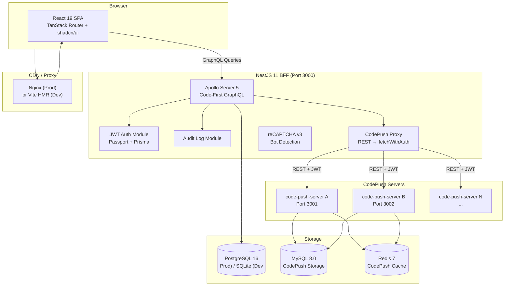
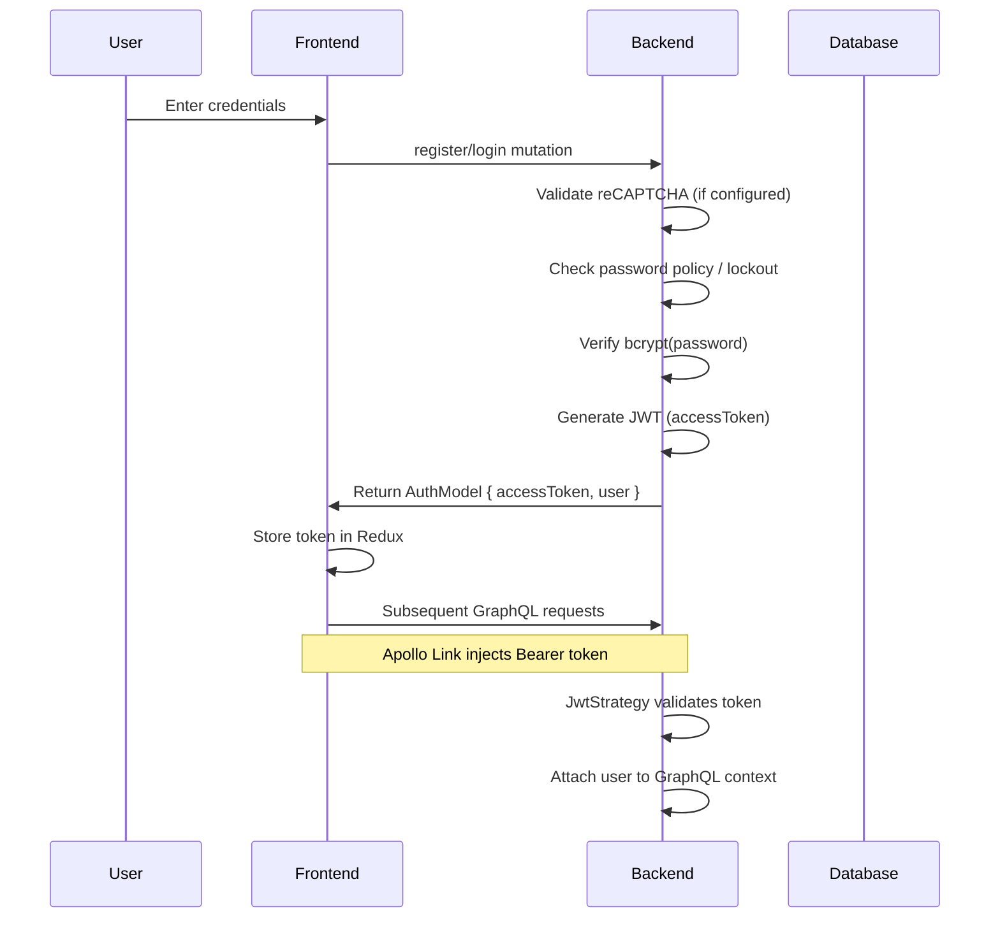
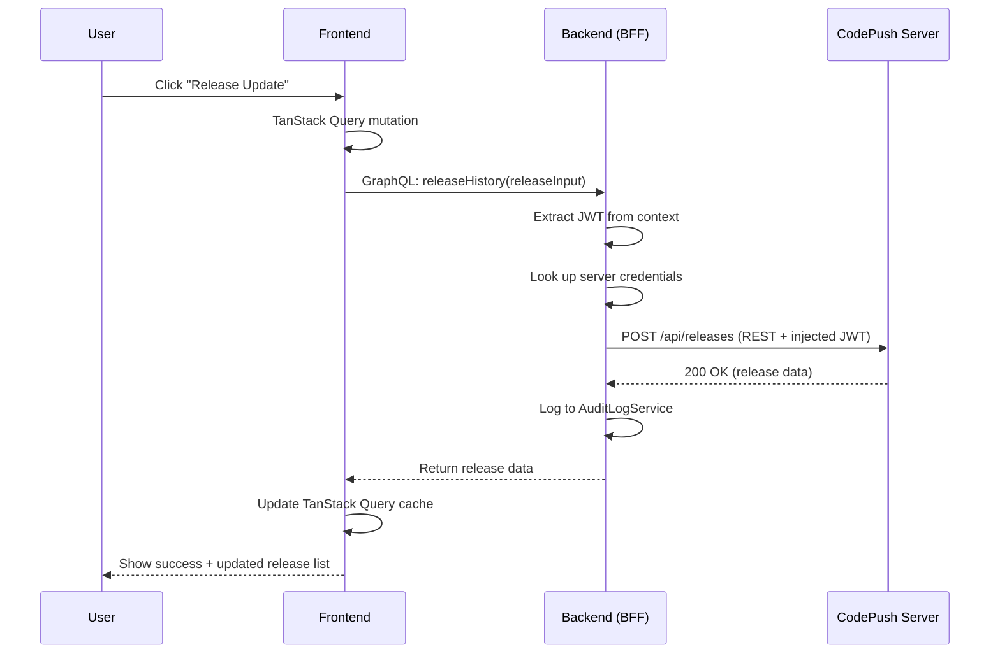

# 🏛️ System Architecture

HyperPush is a **Backend-for-Frontend (BFF)** system that presents a GraphQL API to the React frontend while proxying REST calls to one or more `code-push-server` instances.

---

## 🎯 Architecture Diagram



---

## 🧱 Layer Breakdown

### 1. Frontend Layer — React 19 SPA

The frontend is a single-page application built with React 19 and TypeScript. It uses **TanStack Router** for file-based routing with 8 dashboard pages and public routes.

**State Management (3 layers with strict separation):**

| State Type | Tool | Scope | Rules |
|------------|------|-------|-------|
| Global UI | Redux Toolkit | Auth state, theme, sidebar | Never overlap layers |
| GraphQL Data | Apollo Client | Cache normalization | Data from GraphQL → Apollo |
| REST Server State | TanStack Query | CodePush operations | Data from REST → TanStack Query |

**Key files:**

- [`frontend/src/app/App.tsx`](/frontend/src/app/App.tsx) — Root component with providers
- [`frontend/src/app/router.ts`](/frontend/src/app/router.ts) — TanStack Router configuration
- [`frontend/src/app/lib/apollo.ts`](/frontend/src/app/lib/apollo.ts) — Apollo Client with JWT auth link
- [`frontend/src/app/store/index.ts`](/frontend/src/app/store/index.ts) — Redux store configuration

### 2. BFF Layer — NestJS 11 GraphQL Gateway

The backend is a NestJS 11 application using Apollo Server 5 with **code-first** GraphQL (decorators auto-generate the schema).

**Modules:**

| Module | Responsibility |
|--------|---------------|
| [`AuthModule`](/backend/src/auth/auth.module.ts) | Registration, login, JWT, 2FA, user management |
| [`ServersModule`](/backend/src/servers/servers.module.ts) | CodePush server CRUD |
| [`ApiKeysModule`](/backend/src/api-keys/api-keys.module.ts) | API key management |
| [`CodepushModule`](/backend/src/codepush/codepush.module.ts) | CodePush proxy (all REST operations) |
| [`AuditLogModule`](/backend/src/audit-log/audit-log.module.ts) | Audit trail |
| [`RecaptchaModule`](/backend/src/common/recaptcha/recaptcha.module.ts) | reCAPTCHA v3 verification |

**Key files:**

- [`backend/src/app.module.ts`](/backend/src/app.module.ts) — Root module
- [`backend/src/main.ts`](/backend/src/main.ts) — Bootstrap, CORS, auto-migration
- [`backend/src/auth/jwt.strategy.ts`](/backend/src/auth/jwt.strategy.ts) — Passport JWT strategy

### 3. CodePush Proxy Layer

The [`CodepushService`](/backend/src/codepush/codepush.service.ts) acts as a transparent REST proxy. For each server registered in HyperPush:

1. The proxy logs into the remote code-push-server using stored credentials
2. It receives a JWT token scoped to that server
3. It injects the token as a `Bearer` header on every subsequent request via `fetchWithAuth()`
4. This shields the frontend from ever handling CodePush credentials directly

### 4. Database Layer

| Environment | Database | Location |
|-------------|----------|----------|
| **Development** | SQLite via Prisma | `backend/dev.db` |
| **Production** | PostgreSQL 16 | Managed externally (RDS or standalone) |

The [Prisma schema](/backend/prisma/schema.prisma) defines 6 models:

```
User → Server → App → Deployment → Release
User → ApiKey
User → AuditLog
```

Migrations auto-run on application startup via a hook in [`main.ts`](/backend/src/main.ts).

---

## 🔐 Authentication Flow



**Two-factor authentication flow:**

1. User sets up 2FA in Settings → `setup2fa` mutation returns TOTP secret + URI
2. User scans QR code with authenticator app
3. User enters current TOTP code → `enable2fa` mutation stores encrypted secret
4. Next login: password verification returns `tempToken`, user enters TOTP code → `verify2fa` returns final `accessToken`

---

## 🔄 Request Flow Example — Release an App Update



---

## 🐳 Container Architecture

### Development (`compose.yml` + `compose.dev.yml`)

- **Frontend**: Vite dev server with hot module replacement (HMR)
- **Backend**: NestJS with `ts-node` hot reload
- **CodePush**: `code-push-server` with MySQL + Redis
- **Volumes**: Source code mounted for live editing

### Production (`compose.yml` + `compose.codepush.yml` + `deploy/compose.prod.yml`)

- **Frontend**: Nginx serving built static files (~23MB image)
- **Backend**: Compiled NestJS running as non-root `node` user
- **CodePush**: Same as dev, behind Nginx reverse proxy
- **No volume mounts**: Immutable containers, all state in DB

The frontend [`Dockerfile`](/frontend/Dockerfile) uses a **5-stage multi-architecture build**:

```
base → deps → dev → build → production (Nginx)
```

The backend [`Dockerfile`](/backend/Dockerfile) uses a **3-stage build**:

```
base → build → production (non-root node)
```

---

## ☁️ Infrastructure as Code

The [`infra/`](/infra/) directory contains AWS CDK (TypeScript) for provisioning:

- **VPC** with public/private subnets
- **ECS Fargate** cluster with auto-scaling
- **RDS** PostgreSQL instance
- **ElastiCache** Redis cluster
- **Application Load Balancer** (ALB)
- **ECR** repositories for Docker images

See [`infra/lib/hyperpush-stack.ts`](/infra/lib/hyperpush-stack.ts) for the full stack definition.
