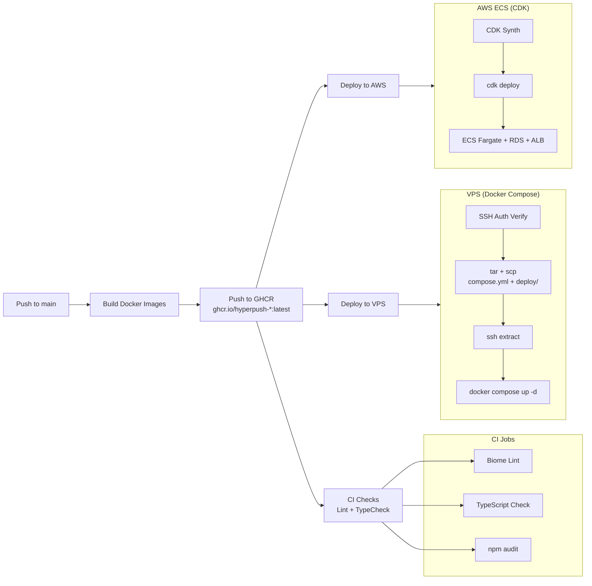

# 🔄 CI/CD Pipeline

HyperPush uses GitHub Actions for continuous integration and deployment. The same codebase deploys to two targets — VPS (Docker Compose) and AWS ECS (CDK) — sharing the same Docker images from GHCR.

---

## 📋 Pipeline Overview



---

## ✅ CI Workflow — [`ci.yml`](/.github/workflows/ci.yml)

**Trigger**: Every push to `main` and all pull requests.

### Jobs

#### 1. Backend Checks

```yaml
backend:
  runs-on: ubuntu-latest
  defaults:
    run:
      working-directory: backend
  steps:
    - uses: actions/checkout@v4
    - uses: oven-sh/setup-bun@v2
    - run: bun install
    - run: bunx biome lint .          # Biome linter
    - run: bunx tsc --noEmit           # TypeScript type check
    - run: npm audit --audit-level=high # Dependency vulnerability scan
      continue-on-error: true           # Non-blocking
```

#### 2. Frontend Checks

```yaml
frontend:
  runs-on: ubuntu-latest
  defaults:
    run:
      working-directory: frontend
  steps:
    - uses: actions/checkout@v4
    - uses: oven-sh/setup-bun@v2
    - run: bun install
    - run: bunx biome lint .          # Biome linter
    - run: bunx tsc --noEmit           # TypeScript type check
    - run: npm audit --audit-level=high # Dependency vulnerability scan
      continue-on-error: true           # Non-blocking
```

### What CI Checks

| Check | Tool | Blocking | Purpose |
|-------|------|----------|---------|
| Linting | Biome | ✅ Yes | Code style and best practices |
| TypeScript | `tsc --noEmit` | ✅ Yes | Type correctness |
| npm audit | `npm audit` | ❌ No (info) | High/critical vulnerability notification |

---

## 🚀 VPS Deployment — [`deploy-vps.yml`](/.github/workflows/deploy-vps.yml)

**Trigger**: Push to `main` branch.

### Pipeline Flow

```
Build Docker images → Push to GHCR → Setup SSH → Verify SSH → 
Sync files (tar + scp + extract) → docker compose up -d
```

### Step Details

| Step | Action | Description |
|------|--------|-------------|
| 1. **Build** | `docker buildx build` | Multi-architecture (linux/amd64, linux/arm64) |
| 2. **Push** | `docker push` | Push to `ghcr.io/hyperpush-*` |
| 3. **SSH Setup** | Write key + `ssh-keyscan` | Configure `~/.ssh/hyperpush-deploy` |
| 4. **SSH Verify** | `ssh -o BatchMode=yes "echo SSH_AUTH_OK"` | **Progressive diagnostics** — validates before transferring |
| 5. **MkDir** | `mkdir -p /opt/hyperpush/deploy` | Ensure target directory exists |
| 6. **Sync** | `tar` → `scp` → `ssh tar xzf` | Atomic file transfer (one network round-trip) |
| 7. **Deploy** | `docker compose up -d` | Pull latest images and restart |

### Key Design Decisions

- **Progressive SSH diagnostics**: Each step validates before proceeding — port check → key validation → auth test → file transfer, each with actionable error messages
- **Native `tar + scp + ssh`** instead of `appleboy/scp-action`: Avoids known SSH handshake failures with ED25519 keys in drone-scp v1.6.14
- **Atomic file transfer**: Files are tar'd locally, SCP'd as one archive, then extracted on the VPS — no partial deployments

---

## ☁️ AWS ECS Deployment — [`deploy.yml`](/.github/workflows/deploy.yml)

**Trigger**: Push to `main` branch.

### Pipeline Flow

```
Build Docker images → Push to ECR → CDK Synth → cdk deploy
```

### Infrastructure

Defined in [`infra/lib/hyperpush-stack.ts`](/infra/lib/hyperpush-stack.ts):

| Resource | Configuration |
|----------|---------------|
| **VPC** | Public + private subnets across 2 AZs |
| **ECS Fargate** | Auto-scaling cluster |
| **RDS** | PostgreSQL instance |
| **ElastiCache** | Redis cluster |
| **ALB** | Application Load Balancer |
| **ECR** | Docker image repositories |

---

## 📦 Dependabot — [`dependabot.yml`](/.github/dependabot.yml)

Automatic weekly dependency updates:

| Ecosystem | Location | Schedule | Grouping |
|-----------|----------|----------|----------|
| **npm (backend)** | `/backend` | Weekly | `@nestjs/*`, `prisma`, other |
| **npm (frontend)** | `/frontend` | Weekly | `react*`, `@apollo*`, `@tanstack/*`, other |
| **GitHub Actions** | `.github` | Weekly | Grouped together |

Dependabot creates automated PRs with grouped dependency updates, reducing noise while keeping dependencies current.

---

## 🐳 Docker Build Strategy

### Shared Image Registry

Both VPS and AWS deployments use the **same Docker images** from GHCR:

```
ghcr.io/hyperpush-app:latest       # Backend (NestJS)
ghcr.io/hyperpush-frontend:latest  # Frontend (Nginx)
```

Images are built once and deployed to both targets, ensuring consistency.

### Multi-Architecture Builds

```yaml
- name: Set up QEMU
  uses: docker/setup-qemu-action@v3

- name: Set up Docker Buildx
  uses: docker/setup-buildx-action@v3

- name: Build and push
  uses: docker/build-push-action@v6
  with:
    platforms: linux/amd64,linux/arm64
    push: true
    tags: ghcr.io/hyperpush-app:latest
```

### Frontend Multi-Stage Build

The frontend [`Dockerfile`](/frontend/Dockerfile) has 5 stages with strategic layer ordering:

```
1. base        — Node.js 22 Alpine
2. deps        — COPY package.json → npm install (cached until deps change)
3. dev         — COPY source code, install dev dependencies
4. build       — npm run build (production build)
5. production  — nginx:1.27-alpine, COPY from build stage
```

### Backend Multi-Stage Build

The backend [`Dockerfile`](/backend/Dockerfile) has 3 stages:

```
1. base        — Node.js 22 Alpine
2. build       — Install all deps, compile TypeScript
3. production  — Minimal runtime, non-root USER node
```

---

## 🔧 Workflow Files Reference

| File | Purpose |
|------|---------|
| [`.github/workflows/ci.yml`](/.github/workflows/ci.yml) | PR checks — lint, typecheck, npm audit |
| [`.github/workflows/deploy-vps.yml`](/.github/workflows/deploy-vps.yml) | VPS Docker Compose deployment |
| [`.github/workflows/deploy.yml`](/.github/workflows/deploy.yml) | AWS ECS CDK deployment |
| [`.github/dependabot.yml`](/.github/dependabot.yml) | Automated dependency updates |
