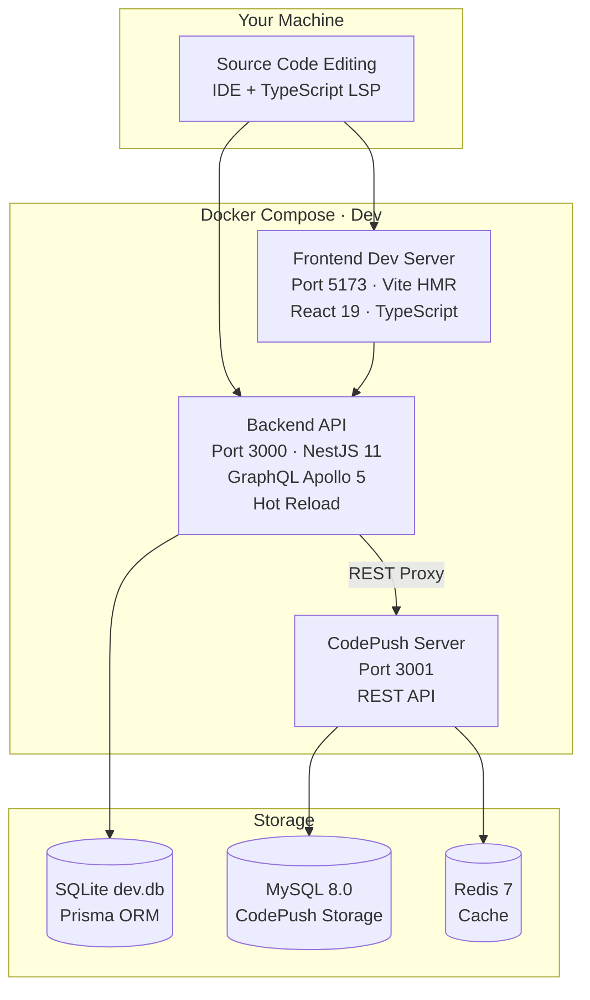

# 💻 Development Guide

Complete guide for developing HyperPush — setup, workflow, backend, frontend, database, testing, and code quality.

---

## 📋 Prerequisites

| Tool | Version | Purpose |
|------|---------|---------|
| **Docker** | 24+ | Containerized services |
| **Docker Compose** | 2.x | Service orchestration |
| **Bun** | 1.3+ | Package manager |
| **Node.js** | 22+ | NestJS CLI, TypeScript |
| **Git** | — | Version control |

### Verify Installation

```bash
docker --version
docker compose version
bun --version
node --version
git --version
```

---

## 🚀 Initial Setup

### 1. Clone the Repository

```bash
git clone https://github.com/MrBigPorter/hyperpush.git
cd hyperpush
```

### 2. Install Dependencies

```bash
cd backend && bun install && cd ..
cd frontend && bun install && cd ..
```

### 3. Configure Environment

```bash
cp backend/.env.example backend/.env
```

Key dev environment variables in [`backend/.env`](/backend/.env):

| Variable | Default | Notes |
|----------|---------|-------|
| `DATABASE_URL` | `file:./dev.db` | SQLite for local dev |
| `JWT_SECRET` | `your-jwt-secret-change-in-production` | Change for production |
| `PORT` | `3000` | Backend server port |
| `NODE_ENV` | `development` | Enables debug tools |
| `RECAPTCHA_SECRET_KEY` | *(empty)* | Skip reCAPTCHA in dev mode |

### 4. Start Development Environment

```bash
# Start all services with hot reload
docker compose -f compose.yml -f compose.dev.yml up -d --build

# Or use the Makefile shortcut
make dev-up
```

### 5. Wait for Database Migration

The backend auto-runs Prisma migrations on startup:

```bash
docker compose logs -f app | grep -m1 "Nest application successfully started"
```

### 6. Access

| Service | URL |
|---------|-----|
| **Frontend** | http://localhost:5173 |
| **Backend API** | http://localhost:3000/graphql |
| **GraphiQL** | http://localhost:3000/graphql |
| **code-push-server** | http://localhost:3001 |

---

## 📁 Project Structure

```
hyperpush/
├── backend/                          # 🟢 NestJS 11 BFF
│   ├── src/
│   │   ├── auth/                     # JWT authentication module
│   │   │   ├── auth.module.ts        # Module definition
│   │   │   ├── auth.resolver.ts      # GraphQL: register, login, updateUser
│   │   │   ├── auth.service.ts       # Business logic + JWT signing
│   │   │   ├── two-factor.service.ts # TOTP 2FA (speakeasy + encrypted storage)
│   │   │   └── jwt.strategy.ts       # Passport JWT strategy
│   │   ├── codepush/                 # 🔴 CodePush proxy (core feature)
│   │   │   ├── codepush.module.ts    # Module definition
│   │   │   ├── codepush.resolver.ts  # GraphQL CRUD for CodePush resources
│   │   │   ├── codepush.service.ts   # REST proxy with JWT injection
│   │   │   ├── codepush-db.service.ts# MySQL connection for CodePush admin
│   │   │   └── codepush.controller.ts# REST multipart upload handler
│   │   ├── servers/                  # Server CRUD management
│   │   ├── api-keys/                 # API key management
│   │   ├── audit-log/                # Audit trail module
│   │   ├── prisma/                   # Prisma service
│   │   ├── graphiql/                 # GraphiQL IDE (dev only)
│   │   ├── common/                   # Shared utilities
│   │   │   ├── recaptcha/           # reCAPTCHA v3 verification
│   │   │   └── scalars/             # Custom GraphQL scalars (JSON)
│   │   └── app.module.ts             # Root module
│   ├── prisma/
│   │   └── schema.prisma             # Data model: 6 models
│   └── Dockerfile                    # 3-stage Docker build
│
├── frontend/                         # 🔵 React 19 SPA
│   ├── src/app/
│   │   ├── routes/                   # TanStack Router pages
│   │   │   └── dashboard/            # 8 dashboard pages
│   │   ├── store/                    # Redux Toolkit (auth + theme)
│   │   ├── lib/                      # Apollo Client + GraphQL operations
│   │   ├── components/               # Shared UI components
│   │   └── types/                    # TypeScript interfaces
│   ├── components/ui/                # shadcn/ui primitives
│   └── Dockerfile                    # 5-stage Docker build
│
├── deploy/                           # Production deployment files
│   └── compose.prod.yml              # Production Docker Compose
│
├── infra/                            # AWS CDK infrastructure
│   └── lib/hyperpush-stack.ts        # VPC, ECS, RDS, Redis, ALB
│
├── compose.yml                       # Base Docker Compose
├── compose.dev.yml                   # Dev overrides (hot reload)
├── compose.codepush.yml              # CodePush services (MySQL + Redis)
└── Makefile                          # Command shortcuts
```

---

## 💻 Development Workflow

### Local Development Architecture



### Development Cycle

```
1. Edit code
2. Frontend: Vite HMR updates browser in <100ms
3. Backend: NestJS hot-reload on file change (~2s)
4. GraphQL: Schema auto-generates from decorators
5. Database: Prisma generates types from schema
6. Commit: Biome lints and formats on pre-commit
```

### Environment Variables (Dev)

Configured in [`compose.dev.yml`](/compose.dev.yml):

| Variable | Dev Value | Purpose |
|----------|-----------|---------|
| `NODE_ENV` | `development` | Enables debug logging, dev tools |
| `CHOKIDAR_USEPOLLING` | `true` | Enables file watching in Docker |
| `VITE_API_URL` | `/graphql` | Frontend API proxy |

### Useful Commands

| Command | Description |
|---------|-------------|
| `make dev-up` | Start all dev services |
| `make dev-down` | Stop all dev services |
| `docker compose logs -f app` | Watch backend logs |
| `docker compose logs -f frontend` | Watch frontend logs |
| `docker compose build --no-cache app` | Rebuild backend from scratch |
| `docker compose down -v` | Stop and delete volumes (⚠️ resets DB) |

---

## 🔧 Backend Development

### Key Files

| File | Purpose |
|------|---------|
| [`backend/src/app.module.ts`](/backend/src/app.module.ts) | Root module — imports all feature modules |
| [`backend/src/main.ts`](/backend/src/main.ts) | Bootstrap — starts NestJS, configures CORS, Prisma migration hook |
| [`backend/prisma/schema.prisma`](/backend/prisma/schema.prisma) | Data model (User, Server, App, Deployment, Release, ApiKey, AuditLog) |
| [`backend/src/auth/jwt.strategy.ts`](/backend/src/auth/jwt.strategy.ts) | Passport JWT strategy — validates tokens |
| [`backend/src/auth/auth.service.ts`](/backend/src/auth/auth.service.ts) | Core auth logic — register, login, 2FA, ban/unban |

### Adding a New GraphQL Resolver

1. **Create module directory**: `backend/src/<feature>/`
2. **Create files**: `<feature>.module.ts`, `<feature>.resolver.ts`, `<feature>.service.ts`
3. **Define GraphQL types** using `@ObjectType()` decorators
4. **Add queries/mutations** using `@Query()` and `@Mutation()` decorators
5. **Register the module** in [`app.module.ts`](/backend/src/app.module.ts)

Example pattern (from [`auth.resolver.ts`](/backend/src/auth/auth.resolver.ts)):

```typescript
@Resolver()
export class AuthResolver {
  constructor(private readonly authService: AuthService) {}

  @Mutation(() => AuthModel)
  async register(@Args('input') input: RegisterInput) {
    return this.authService.register(input);
  }

  @Query(() => UserModel)
  @UseGuards(GqlAuthGuard)
  async me(@CurrentUser() user: UserModel) {
    return user;
  }
}
```

### Authentication Flow

```
Register → bcrypt(password) → Store in DB → Return JWT
Login → Verify bcrypt(password) → Return JWT
Every GQL request → Extract JWT from Bearer header → Verify → Attach user to context
```

### Adding a Prisma Migration

```bash
# Enter the backend container
docker compose exec app sh

# Create a new migration
npx prisma migrate dev --name your_migration_name

# Apply migrations
npx prisma migrate deploy
```

---

## 🎨 Frontend Development

### Key Files

| File | Purpose |
|------|---------|
| [`frontend/src/app/router.ts`](/frontend/src/app/router.ts) | TanStack Router configuration |
| [`frontend/src/app/lib/apollo.ts`](/frontend/src/app/lib/apollo.ts) | Apollo Client setup with auth link |
| [`frontend/src/app/lib/graphql.ts`](/frontend/src/app/lib/graphql.ts) | GraphQL query/mutation definitions |
| [`frontend/src/app/store/index.ts`](/frontend/src/app/store/index.ts) | Redux store configuration |
| [`frontend/src/app/types/models.ts`](/frontend/src/app/types/models.ts) | TypeScript interfaces matching GraphQL schema |

### Adding a New Page

1. **Create component** in `frontend/src/app/routes/dashboard/<PageName>.tsx`
2. **Define route** in [`frontend/src/app/routes/dashboard/index.ts`](/frontend/src/app/routes/dashboard/index.ts)
3. **Add GraphQL operations** in [`frontend/src/app/lib/graphql.ts`](/frontend/src/app/lib/graphql.ts)
4. **Add navigation link** in the Sidebar component

Example page pattern:

```typescript
import { useQuery } from '@apollo/client';
import { GET_USERS } from '../../lib/graphql';

export function UsersPage() {
  const { loading, error, data } = useQuery(GET_USERS);

  if (loading) return <Skeleton />;
  if (error) return <div>Error: {error.message}</div>;

  return (
    <div>
      {data.users.map(user => (
        <div key={user.id}>{user.name}</div>
      ))}
    </div>
  );
}
```

### State Management Rules

| State Type | Tool | Location |
|------------|------|----------|
| Global UI (theme, sidebar) | Redux Toolkit | `store/slices/` |
| Auth (user, token) | Redux Toolkit | `store/slices/authSlice.ts` |
| GraphQL data | Apollo Client | `lib/apollo.ts` |
| REST / server data | TanStack Query | Via hooks |

**Golden rule:** Never overlap state layers. If data comes from GraphQL → Apollo. If from REST → TanStack Query. If pure UI → Redux.

### UI Components

The project uses [shadcn/ui](https://ui.shadcn.com/) primitives with Tailwind CSS 4:

| Component | File |
|-----------|------|
| `Button` | [`components/ui/button.tsx`](/frontend/src/components/ui/button.tsx) |
| `Badge` | [`components/ui/badge.tsx`](/frontend/src/components/ui/badge.tsx) |
| `Dialog` | [`components/ui/dialog.tsx`](/frontend/src/components/ui/dialog.tsx) |
| `Select` | [`components/ui/select.tsx`](/frontend/src/components/ui/select.tsx) |
| `Table` | [`components/ui/table.tsx`](/frontend/src/components/ui/table.tsx) |
| `Tabs` | [`components/ui/tabs.tsx`](/frontend/src/components/ui/tabs.tsx) |
| `Skeleton` | [`components/ui/skeleton.tsx`](/frontend/src/components/ui/skeleton.tsx) |

---

## 🗄️ Database

### SQLite (Development)

The dev environment uses SQLite via Prisma's `@prisma/adapter-pg` compatibility layer. No PostgreSQL installation is needed.

```bash
# Database file location
backend/dev.db
```

### PostgreSQL (Production)

Production uses PostgreSQL 16. The Prisma schema abstracts the difference — the same schema works for both.

### Prisma Studio

```bash
# Open the Prisma data browser
docker compose exec app npx prisma studio
```

### Database Management Commands

| Command | Description |
|---------|-------------|
| `npx prisma migrate dev --name <name>` | Create a new migration |
| `npx prisma migrate deploy` | Apply pending migrations |
| `npx prisma migrate reset` | Reset database (⚠️ deletes all data) |
| `npx prisma studio` | Open data browser |
| `npx prisma generate` | Regenerate Prisma client types |

### Schema Overview

The [`schema.prisma`](/backend/prisma/schema.prisma) defines 6 models:

```
User → Server → App → Deployment → Release
User → ApiKey
User → AuditLog
```

---

## 🧪 Testing

> **Note**: Tests are not yet implemented but the infrastructure is ready.

### Backend (Jest, planned)

```bash
# Run backend tests
docker compose exec app npx jest

# Watch mode
docker compose exec app npx jest --watch
```

### Frontend (Vitest, planned)

```bash
# Run frontend tests
docker compose exec frontend bun test
```

### Manual Testing

```bash
# Test GraphQL API with curl
curl -X POST http://localhost:3000/graphql \
  -H "Content-Type: application/json" \
  -d '{"query": "{ __typename }"}'

# Test registration
curl -X POST http://localhost:3000/graphql \
  -H "Content-Type: application/json" \
  -d '{"query": "mutation { register(input: { username: \"test\", password: \"test123\", name: \"Test\" }) { accessToken } }"}'
```

---

## ✅ Code Quality

### Tools

| Tool | Purpose | Configuration |
|------|---------|---------------|
| [Biome](https://biomejs.dev/) | Linter + formatter | [`biome.json`](/biome.json) |
| TypeScript | Type checking | `tsconfig.json` (strict mode) |

### Commands

```bash
# Lint all files
npx @biomejs/biome lint .

# Format all files
npx @biomejs/biome format --write .

# Check + format in one pass
npx @biomejs/biome check --apply .

# TypeScript type check (backend and frontend)
cd backend && npx tsc --noEmit
cd frontend && npx tsc --noEmit
```

### Pre-commit Workflow (Recommended)

```bash
# Before committing:
npx @biomejs/biome check --apply .  # Auto-fix lint + format
npx tsc --noEmit                       # Type check
```

Pre-commit hooks are configured via [Husky](/.husky/) and will run automatically on `git commit`.

---

## 🔍 Troubleshooting

| Symptom | Likely Cause | Solution |
|---------|-------------|----------|
| `Port 3000 already in use` | Another process using the port | `lsof -i :3000` and kill the process |
| `PrismaClientInitializationError` | Database not migrated | `docker compose exec app npx prisma migrate dev` |
| `Module not found` | Dependencies not installed | `cd backend && bun install` |
| `GraphQL schema mismatch` | Backend/frontend out of sync | Restart both containers |
| `Docker build fails` | Network issue or cache corruption | `docker compose build --no-cache` |
| `Hot reload not working` | File watcher issue on macOS | Ensure `CHOKIDAR_USEPOLLING=true` in compose.dev.yml |
| `CORS error in browser` | Backend CORS config | Check `app.enableCors()` in [`main.ts`](/backend/src/main.ts) |
| `401 Unauthorized` | JWT token expired | Log out and log in again |
| CodePush requests failing | Server API key invalid | Update server API key in HyperPush console |

### Quick Reset

If everything is broken:

```bash
# Full reset
make dev-down
docker compose down -v  # ⚠️ Deletes the database
docker compose -f compose.yml -f compose.dev.yml up -d --build

# Re-run migrations
docker compose exec app npx prisma migrate dev
```
