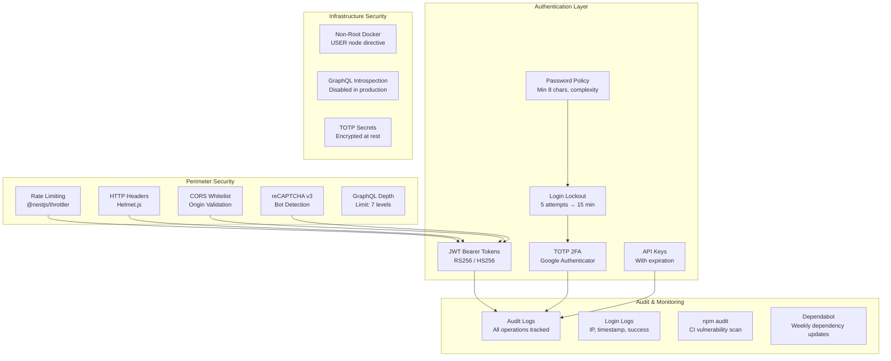

# 🔒 Security Features

HyperPush implements multiple layers of security — from authentication and access control to network protection and dependency scanning.

---

## 📋 Security Overview



---

## 🔐 Authentication

### JWT (JSON Web Tokens)

- **Strategy**: Passport.js JWT strategy ([`jwt.strategy.ts`](/backend/src/auth/jwt.strategy.ts))
- **Token contents**: `{ sub: userId, email, role }`
- **Expiration**: Configurable via `JWT_EXPIRATION` env var (default: 7 days)
- **Transport**: `Authorization: Bearer <token>` header
- **Validation**: Every GraphQL request (except `register` and `login`) requires a valid JWT

### Two-Factor Authentication (TOTP)

- **Library**: `speakeasy` for TOTP generation and verification
- **Secret storage**: Encrypted at rest using AES-256-GCM with `TOTP_ENCRYPTION_KEY`
- **Supported apps**: Google Authenticator, Authy, 1Password, Bitwarden, any TOTP-compatible app
- **Flow**:
  1. `setup2fa` mutation → returns TOTP secret + `otpauth://` URI
  2. User scans QR code with authenticator app
  3. `enable2fa` mutation → verifies current TOTP code + stores encrypted secret
  4. Login flow: password → `tempToken` → TOTP code → `accessToken`

### reCAPTCHA v3

- **Service**: Google reCAPTCHA v3 (invisible, no user interaction)
- **Score range**: 0.0 (bot) to 1.0 (human)
- **Threshold**: Configurable via `RECAPTCHA_THRESHOLD` (default: 0.5)
- **Applied to**: `register` and `login` mutations
- **Dev mode**: Skipped when `RECAPTCHA_SECRET_KEY` is empty
- **Integration**:
  - Backend: [`RecaptchaService`](/backend/src/common/recaptcha/recaptcha.service.ts) verifies tokens with Google API
  - Frontend: [`RecaptchaProvider`](/frontend/src/app/components/RecaptchaProvider.tsx) provides `executeRecaptcha` via context

### Password Policy

| Requirement | Value |
|-------------|-------|
| Minimum length | 8 characters |
| Maximum length | 100 characters |
| Complexity | At least 1 uppercase, 1 lowercase, 1 digit |
| Configuration | [`backend/src/auth/auth.service.ts`](/backend/src/auth/auth.service.ts) — `validatePassword()` |

### Login Lockout

- **Threshold**: 5 failed login attempts within 15 minutes
- **Duration**: Lockout expires after 15 minutes (auto-resets `loginAttempts` to 0)
- **Storage**: Prisma `User` model — `loginAttempts` + `lockoutUntil` fields
- **Implementation**: [`AuthService.login()`](/backend/src/auth/auth.service.ts) checks lockout before password verification

### API Keys

- **Purpose**: Programmatic access to HyperPush API
- **Expiration**: Configurable per key (optional)
- **Prefix**: Keys are displayed with a prefix for identification, full key shown once on creation
- **Storage**: Hashed in database (never stored in plaintext)

---

## 🛡️ Network Security

### Rate Limiting

- **Library**: `@nestjs/throttler`
- **Global limit**: 100 requests per 60 seconds per IP
- **Login limit**: 10 requests per 60 seconds per IP (stricter)
- **Guard**: [`GqlThrottlerGuard`](/backend/src/auth/guards/gql-throttler.guard.ts) wraps GraphQL requests
- **Configuration**: [`AuthModule`](/backend/src/auth/auth.module.ts) — `ThrottlerModule.forRoot()`

### HTTP Security Headers (Helmet)

Applied in [`main.ts`](/backend/src/main.ts):

```typescript
app.use(helmet());
```

This sets standard security headers:
- `X-Content-Type-Options: nosniff`
- `X-Frame-Options: SAMEORIGIN`
- `X-XSS-Protection: 0`
- `Strict-Transport-Security` (when served over HTTPS)
- `Content-Security-Policy` headers

### CORS Configuration

Applied in [`main.ts`](/backend/src/main.ts):

```typescript
app.enableCors({
  origin: process.env.CORS_ORIGINS
    ? process.env.CORS_ORIGINS.split(',')
    : process.env.NODE_ENV === 'production'
      ? false
      : ['http://localhost:5173'],
  credentials: true,
});
```

In production, `CORS_ORIGINS` is set to the frontend domain (e.g., `https://hyperpush.org`), ensuring only the legitimate frontend can call the API.

### GraphQL Security

- **Depth limiting**: Max query depth of 7 levels ([`depthLimit(7)`](/backend/src/app.module.ts)) — prevents deeply nested malicious queries
- **Introspection**: **Disabled in production** (`introspection: process.env.NODE_ENV !== 'production'`) — prevents schema discovery
- **Playground**: Disabled in production (`playground: false`)

---

## 📝 Audit Logging

### Audit Log

Every important operation is logged with:

| Field | Description |
|-------|-------------|
| `action` | Operation name (e.g., `register`, `create_server`, `delete_api_key`) |
| `entity` | Affected entity type (e.g., `user`, `server`, `api_key`) |
| `entityId` | ID of the affected entity |
| `detail` | Human-readable description of the action |
| `userId` | ID of the user who performed the action |
| `ip` | IP address of the requester |
| `createdAt` | Timestamp |

**Logged actions:**

| Module | Actions |
|--------|---------|
| Auth | `register`, `change_password`, `update_user`, `ban_user`, `unban_user`, `setup_2fa`, `enable_2fa`, `disable_2fa` |
| Servers | `create_server`, `update_server`, `delete_server` |
| API Keys | `create_api_key`, `delete_api_key` |

Audit logs are **read-only** — they cannot be deleted or modified through the API. Queryable via GraphQL with filtering and pagination.

### Login Log

- **Separate table** (`LoginLog` in Prisma schema) — distinct from audit logs
- Records: userId, IP address, user agent, success/failure, timestamp

---

## 🔄 CI/CD Security

### Dependency Vulnerability Scanning

Runs on every PR and push to `main` via [`ci.yml`](/.github/workflows/ci.yml):

```yaml
- name: npm audit
  run: npm audit --audit-level=high
  continue-on-error: true
```

Scans both `backend/` and `frontend/` dependencies for high/critical severity vulnerabilities.

### Dependabot

Automatic weekly dependency updates via [`.github/dependabot.yml`](/.github/dependabot.yml):

| Ecosystem | Schedule | Grouping |
|-----------|----------|----------|
| `backend` (npm) | Weekly | `@nestjs/*`, `prisma`, other |
| `frontend` (npm) | Weekly | `react*`, `@apollo*`, `@tanstack/*`, other |
| `github-actions` | Weekly | All grouped |

---

## 🐳 Docker Security

- **Non-root user**: The production backend container runs as `USER node` (UID 1000) instead of root
- **Multi-stage builds**: Production images are minimal (no build tools, no dev dependencies)
- **Frontend image**: Uses `nginx:1.27-alpine` (~23MB) instead of Node.js
- **Immutable containers**: No volume mounts for application code; all state in database
- **Health checks**: `HEALTHCHECK` directive ensures container readiness

---

## 🔑 Environment Variables

| Variable | Purpose | Required |
|----------|---------|----------|
| `JWT_SECRET` | JWT signing secret | Yes |
| `JWT_EXPIRATION` | JWT token lifetime (default: `7d`) | No |
| `TOTP_ENCRYPTION_KEY` | AES-256-GCM key for TOTP secrets (32 hex chars) | Yes (for 2FA) |
| `RECAPTCHA_SECRET_KEY` | Google reCAPTCHA v3 secret key | No (skipped if empty) |
| `RECAPTCHA_THRESHOLD` | reCAPTCHA score threshold (default: `0.5`) | No |
| `VITE_RECAPTCHA_SITE_KEY` | reCAPTCHA site key for frontend | No (skipped if empty) |
| `CORS_ORIGINS` | Comma-separated allowed origins | Yes (prod) |
| `NODE_ENV` | `development` / `production` | Yes |

See [`backend/.env.example`](/backend/.env.example) for the full list.
