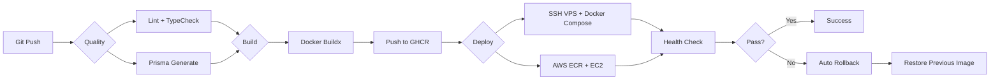

# CodePush 通用管理控制台 — 架构设计 v3

> 更新：从「纯前端 SPA」重构为「SPA + BFF 闭环平台」
> 关键转折：用户提出"你再想想一个闭环的" — 纯 SPA 不是真正的闭环

---

## 一、为什么纯 SPA 不是闭环？

之前的方案是：**SPA 直连 lisong/code-push-server REST API**

```
SPA ──→ CodePush Server REST API
```

存在以下缺口：

| 缺口 | 问题 |
|------|------|
| ❌ 无用户系统 | 谁在用这个平台？多个用户怎么协作？ |
| ❌ 配置存 localStorage | 浏览器清除后就丢失，无法跨设备同步 |
| ❌ 无审计日志 | 谁做了什么操作？出问题怎么排查？ |
| ❌ 无 API 密钥管理 | CI/CD 怎么自动化调用？ |
| ❌ 部署不完整 | 用户需要自己配 Nginx、自己部署 SPA |
| ❌ 面试价值有限 | "不就是个 API 的图形界面吗" |

**真正的闭环 = 自己的后端 + 自己的前端 + 一键部署**

---

## 二、闭环架构总览

```
                        CodePush Console (闭环平台)
                        ==========================

  用户浏览器
      │
      ▼
  ┌────────────────────────────────────────────────────┐
  │                  Nginx (反向代理)                    │
  │                                                     │
  │   / ──────────► SPA (静态文件)                      │
  │   /api/* ─────► NestJS BFF (端口 4000)              │
  └──────────────────────┬──────────────────────────────┘
                         │
                         ▼
  ┌────────────────────────────────────────────────────┐
  │              NestJS BFF (后端服务)                   │
  │                                                     │
  │  ┌──────────┐  ┌──────────┐  ┌────────────────┐    │
  │  │ Auth     │  │ Servers  │  │ Proxy          │    │
  │  │ 注册/登录 │  │ CRUD     │  │ 代理到 CodePush│    │
  │  │ JWT 签发 │  │ 凭据加密 │  │ + 审计日志     │    │
  │  └──────────┘  └──────────┘  └────────┬───────┘    │
  │                                        │           │
  │  ┌──────────┐  ┌──────────┐           │           │
  │  │ ApiKeys  │  │AuditLogs │           │           │
  │  │ CI/CD    │  │ 操作审计  │           │           │
  │  └──────────┘  └──────────┘           │           │
  │                                        │           │
  │  ┌─────────────────────────────────────┴────┐      │
  │  │           SQLite / PostgreSQL             │      │
  │  │  (User, Server, ApiKey, AuditLog)         │      │
  │  └──────────────────────────────────────────┘      │
  └──────────────────────┬──────────────────────────────┘
                         │
                         ▼ (通过 HTTP 代理)
  ┌────────────────────────────────────────────────────┐
  │           lisong/code-push-server                   │
  │           (端口 3000)                               │
  │                                                     │
  │  ┌──────────┐  ┌──────────┐  ┌──────────┐          │
  │  │ Apps     │  │Deployments│  │ Releases │          │
  │  │ CRUD     │  │ CRUD     │  │ 上传/回滚 │          │
  │  └──────────┘  └──────────┘  └──────────┘          │
  │                                                     │
  │  ┌──────────┐  ┌──────────┐                         │
  │  │AccessKeys│  │ Metrics  │                         │
  │  └──────────┘  └──────────┘                         │
  └──────────┬──────────────────┬───────────────────────┘
             │                  │
             ▼                  ▼
        ┌────────┐        ┌────────┐
        │ MySQL  │        │ Redis  │
        │ 8.0    │        │ 7      │
        └────────┘        └────────┘
```

---

## 三、数据流：一次完整操作

以「创建 App + 上传 Release」为例：

```
管理员             前端 SPA             NestJS BFF         CodePush Server
────────          ─────────           ──────────         ──────────────
  │                    │                   │                   │
  │ 1. 登录            │                   │                   │
  │───────────────────►│                   │                   │
  │                    │ 2. POST /api/auth/login              │
  │                    │──────────────────►│                   │
  │                    │◄─────────────────│                   │
  │                    │   返回 JWT Token  │                   │
  │◄───────────────────│                   │                   │
  │                    │                   │                   │
  │ 2. 创建 App        │                   │                   │
  │───────────────────►│                   │                   │
  │                    │ 3. POST /api/servers/:id/apps        │
  │                    │    (携带本平台 JWT) │                   │
  │                    │──────────────────►│                   │
  │                    │                   │ 4. 验证 JWT       │
  │                    │                   │ 5. 查找 Server    │
  │                    │                   │ 6. 解密凭据       │
  │                    │                   │ 7. POST /apps     │
  │                    │                   │    (携带 CodePush JWT)│
  │                    │                   │──────────────────►│
  │                    │                   │◄─────────────────│
  │                    │                   │   返回 App 信息   │
  │                    │                   │ 8. 记录审计日志   │
  │                    │◄─────────────────│                   │
  │                    │   返回 App 数据   │                   │
  │◄───────────────────│                   │                   │
```

关键变化：**前端只和 BFF 通信，BFF 代理所有 CodePush API 调用。**

---

## 四、技术栈 — 最终方案

> 选择 NestJS + GraphQL + Prisma + Supabase/PostgreSQL，最大化求职价值和开发效率。

### 后端 (BFF)

| 技术 | 选型 | 版本 | 理由 |
|------|------|------|------|
| 框架 | **NestJS** | v11 | 企业级 Node.js 框架，招聘需求量大，你已有项目经验 |
| 语言 | TypeScript | 5.7+ | 类型安全 |
| 运行时 | **Node.js** | v22 LTS | 生态最成熟，所有云平台原生支持 |
| 数据库 | **Supabase PostgreSQL** (部署) / SQLite (本地开发) | — | Supabase 免费 500MB，招聘需求多；本地开发用 SQLite 零配置 |
| ORM | **Prisma** | v6 | 与你现有 apps/api 一致，类型安全，迁移简单 |
| API 通信 | **GraphQL** (@nestjs/graphql) ✅ | — | 市场主流，外企面试高频考点 |
| 认证 | JWT + bcrypt + Passport | — | 标准方案，NestJS 原生支持 |
| 邮件 | Nodemailer / Resend | — | 注册验证邮件 |

### 前端 (SPA)

| 技术 | 选型 | 版本 | 理由 |
|------|------|------|------|
| 框架 | **Vite + React 19** | v6 / v19 | 轻量 SPA，无需 SSR |
| UI 组件 | **Shadcn/ui** | latest | 高质量可定制组件 |
| 路由 | **TanStack Router** | v1.100+ | 类型安全路由，参数/查询/路径全部类型推导 |
| 状态 | **Redux Toolkit + RTK** (本地) + **TanStack Query** v5 (服务端) | v2.6+ | 欧美主流状态管理方案 |
| API 客户端 | **Apollo Client** | — | GraphQL 标准客户端 |
| 国际化 | **i18next** | v24 | 中英文 |
| 样式 | **Tailwind CSS 4** | v4 | CSS-first 配置，零配置文件 |

### 开发工具

| 技术 | 选型 | 理由 |
|------|------|------|
| Lint + Format | **Biome** | 替代 ESLint + Prettier，快 10-50x |
| 包管理 | **bun** (install only) | 快速安装，Node.js 运行时 |

### 部署架构 — 双路径方案

HyperPush 的代码是 **Docker 化的**，所以可以部署在任何地方。你只需要切换 `.env` 配置即可切换部署目标。

```
                        HyperPush 应用代码（同一份）
                        ==========================
                         NestJS BFF + Vite SPA
                              ↓ Docker 容器化
                              ↓
               ┌──────────────────────────────┐
               │    选择部署路径                  │
               └──────────────┬───────────────┘
                              │
            ┌─────────────────┼─────────────────┐
            ▼                 ▼                  ▼
   ┌────────────────┐  ┌────────────────┐  ┌──────────────┐
   │  路径 A：AWS    │  │  路径 B：VPS    │  │  路径 C：本地 │
   ├────────────────┤  ├────────────────┤  ├──────────────┤
   │  S3 + CloudFr  │  │  Nginx + Docker │  │  docker-compo│
   │  ont 前端      │  │  同一台 VPS     │  │  se up       │
   │  EC2 BFF      │  │  (跟现有项目    │  │  开发测试用   │
   │  Supabase DB  │  │   一样)         │  │              │
   └────────────────┘  └────────────────┘  └──────────────┘
           │                   │                   │
           └───────────────────┼───────────────────┘
                               ▼
                   ┌──────────────────────┐
                   │    Supabase Free      │
                   │  PostgreSQL 500MB     │
                   │  (或自建 PostgreSQL)   │
                   └──────────────────────┘
```

#### 路径 A：AWS（免费套餐）

```
用户浏览器 → CloudFront CDN
                  │
          ┌───────┴───────┐
          ▼               ▼
   S3 Bucket         EC2 t2.micro
   (前端 SPA)         Docker → NestJS BFF
                              │
                              ▼
                       Supabase PostgreSQL
```

| 组件 | 方式 | 费用 |
|------|------|------|
| BFF (NestJS) | AWS EC2 t2.micro → Docker | $0/月 (12 个月免费) |
| 前端 (SPA) | AWS S3 + CloudFront | $0/月 (免费额度) |
| 数据库 | Supabase PostgreSQL Free | $0/月 (无时间限制) |
| CI/CD | GitHub Actions → SCP/SSH 部署 | $0/月 |

#### 路径 B：VPS（跟现有项目一样的模式）

```
用户浏览器 → 域名 DNS → VPS（DigitalOcean / Linode / 阿里云 / 腾讯云 等）
                               │
                        Nginx（反向代理）
                        ├─ /api/* → NestJS BFF 容器 (port 3000)
                        └─ /*    → Nginx 直接 serve 前端静态文件
                               │
                               ▼
                        Supabase PostgreSQL
                        (或同一台 VPS 上自建 PostgreSQL)
```

| 组件 | 方式 | 费用 |
|------|------|------|
| BFF + 前端 | 同一台 VPS → Docker Compose | $5-10/月 |
| 数据库 | Supabase Free / 自建 PostgreSQL | $0/月 |
| CI/CD | GitHub Actions → SSH 部署 | $0/月 |

#### 路径 C：本地开发

```bash
docker-compose up
# → NestJS BFF 在 localhost:3000
# → Vite SPA 在 localhost:5173
# → 数据库用 SQLite（本地文件，零配置）
```

#### 为什么能做到跨平台？

| 组件 | 原因 |
|------|------|
| **NestJS** | Docker 容器，任何 Linux VPS 都跑得了 |
| **前端 SPA** | 纯静态文件，任何 Web 服务器都 serve 得了 |
| **Supabase** | 用的是标准 PostgreSQL 连接字符串，可以换成任何 PostgreSQL |
| **Dockerfile** | 构建一次，到处运行 |

```dockerfile
# Dockerfile 示例 — 同一份代码，任何平台
# ⚠️ 构建顺序：先安装所有依赖 → build → 再 prune 生产依赖
FROM node:22-alpine AS builder
WORKDIR /app
COPY package.json bun.lock ./
RUN bun install --frozen-lockfile
COPY . .
RUN bun run build

FROM node:22-alpine AS production
WORKDIR /app
COPY --from=builder /app/dist ./dist
COPY --from=builder /app/node_modules ./node_modules
COPY --from=builder /app/package.json ./
EXPOSE 3000
CMD ["node", "dist/main"]
```

**切换部署平台只需要改 `.env` 和 `docker-compose.yml`，代码不动。**

---

## 五、数据库模型设计

```prisma
// BFF 自有数据库 - 轻量设计

model User {
  id        String   @id @default(uuid())
  email     String   @unique
  password  String   // bcrypt hash
  name      String
  createdAt DateTime @default(now())
  updatedAt DateTime @updatedAt

  servers  Server[]
  apiKeys  ApiKey[]
  auditLogs AuditLog[]
}

model Server {
  id        String   @id @default(uuid())
  name      String   // 用户自定义名称，如 "生产环境"
  baseUrl   String   // CodePush 服务器地址
  // 加密存储的凭据
  username  String?  // 管理员邮箱
  // token 不存 DB，运行时维护在内存/缓存中
  createdAt DateTime @default(now())
  updatedAt DateTime @updatedAt

  userId    String
  user      User     @relation(fields: [userId], references: [id])
}

model ApiKey {
  id         String    @id @default(uuid())
  name       String    // 如 "CI/CD 密钥"
  key        String    @unique // 生成的 API Key (hash 存 DB)
  lastUsedAt DateTime?
  createdAt  DateTime  @default(now())

  userId     String
  user       User      @relation(fields: [userId], references: [id])
}

model AuditLog {
  id        String   @id @default(uuid())
  userId    String
  action    String   // 'CREATE_APP', 'RELEASE', 'PROMOTE', 'ROLLBACK'
  resource  String   // 'App', 'Deployment', 'Release'
  detail    String?  // JSON 详情
  createdAt DateTime @default(now())

  user      User     @relation(fields: [userId], references: [id])
}
```

---

## 六、BFF API 设计

### 认证

```
POST /api/auth/register   { email, password, name }
POST /api/auth/login      { email, password } → { token, user }
GET  /api/auth/me         → { user }
```

### 服务器管理

```
GET    /api/servers
POST   /api/servers       { name, baseUrl, username, password }
PUT    /api/servers/:id
DELETE /api/servers/:id
POST   /api/servers/:id/test   // 测试连接
```

### CodePush 资源代理 (由 BFF 转发到后端)

所有 `/api/proxy/...` 路由由 BFF 代理到 CodePush Server：

```
# Apps
GET    /api/proxy/apps
POST   /api/proxy/apps              { name }
GET    /api/proxy/apps/:appId
PUT    /api/proxy/apps/:appId
DELETE /api/proxy/apps/:appId

# Deployments
GET    /api/proxy/apps/:appId/deployments
POST   /api/proxy/apps/:appId/deployments  { name, key }
DELETE /api/proxy/apps/:appId/deployments/:depName

# Releases
POST   /api/proxy/apps/:appId/deployments/:depName/release  (multipart)
GET    /api/proxy/apps/:appId/deployments/:depName/releases
POST   /api/proxy/apps/:appId/deployments/:depName/promote
       { releaseLabel, desc }
POST   /api/proxy/apps/:appId/deployments/:depName/rollback
       { targetRelease }

# Access Keys
GET    /api/proxy/apps/:appId/accessKeys
POST   /api/proxy/apps/:appId/accessKeys    { name }
DELETE /api/proxy/apps/:appId/accessKeys/:keyId
```

### API 密钥管理

```
POST   /api/api-keys      { name }
GET    /api/api-keys
DELETE /api/api-keys/:id
```

### 审计日志

```
GET    /api/audit-logs     ?page=1&limit=20
```

---

## 七、项目结构

```
codepush-console/
├── package.json                 # workspace root
│
├── apps/
│   ├── server/                  # NestJS BFF
│   │   ├── prisma/
│   │   │   └── schema.prisma
│   │   ├── src/
│   │   │   ├── main.ts
│   │   │   ├── app.module.ts
│   │   │   ├── auth/
│   │   │   │   ├── auth.module.ts
│   │   │   │   ├── auth.controller.ts
│   │   │   │   ├── auth.service.ts
│   │   │   │   ├── jwt.strategy.ts
│   │   │   │   └── jwt-auth.guard.ts
│   │   │   ├── servers/
│   │   │   │   ├── servers.module.ts
│   │   │   │   ├── servers.controller.ts
│   │   │   │   └── servers.service.ts
│   │   │   ├── proxy/
│   │   │   │   ├── proxy.module.ts
│   │   │   │   ├── proxy.controller.ts
│   │   │   │   └── proxy.service.ts  # 转发到 CodePush API
│   │   │   ├── api-keys/
│   │   │   ├── audit-logs/
│   │   │   └── common/
│   │   │       ├── prisma/
│   │   │       └── decorators/
│   │   ├── package.json
│   │   ├── tsconfig.json
│   │   ├── Dockerfile
│   │   └── .env.example
│   │
│   └── web/                     # Vite + React SPA
│       ├── public/
│       ├── src/
│       │   ├── main.tsx
│       │   ├── App.tsx
│       │   ├── components/
│       │   │   ├── ui/          # Shadcn/ui
│       │   │   ├── layout/      # Sidebar, Header
│       │   │   └── shared/      # AppCard, ReleaseTimeline
│       │   ├── pages/
│       │   │   ├── login/
│       │   │   ├── register/
│       │   │   ├── dashboard/
│       │   │   ├── servers/     # 服务器连接管理
│       │   │   ├── apps/        # App 列表 + 详情
│       │   │   ├── deployments/ # Deployment 管理
│       │   │   ├── releases/    # Release 上传/历史
│       │   │   ├── audit-logs/  # 审计日志
│       │   │   └── settings/    # API 密钥管理
│       │   ├── api/             # BFF API 客户端
│       │   │   ├── client.ts    # Axios 实例
│       │   │   ├── auth.ts
│       │   │   ├── servers.ts
│       │   │   └── proxy.ts     # 代理 API 调用
│       │   ├── stores/
│       │   │   └── authStore.ts
│       │   ├── i18n/
│       │   │   ├── en.json
│       │   │   └── zh.json
│       │   └── types/
│       ├── package.json
│       ├── vite.config.ts
│       ├── tsconfig.json
│       └── Dockerfile
│
├── docker/
│   ├── docker-compose.yml       # 一键部署
│   └── nginx.conf
│
├── deploy/
│   ├── deploy.sh                # 本地部署脚本
│   ├── rollback.sh              # 回滚脚本
│   └── .env.prod.example        # 生产环境变量模板
│
├── .github/
│   └── workflows/
│       ├── deploy-hyperpush.yml # 主部署工作流
│       ├── deploy-backend.yml   # 后端部署（workflow_call）
│       ├── deploy-frontend.yml  # 前端部署（workflow_call）
│       └── rollback.yml         # 手动回滚（workflow_dispatch）
│
└── README.md                    # 开源项目说明
```

---

## 八、部署架构

### 方案一：独立部署（推荐）

用户部署自己的 CodePush 服务器 + 我们的管理平台：

```
docker/
├── docker-compose.yml           # 包含:
│   ├── codepush-console-server  # NestJS BFF (端口 4000)
│   ├── codepush-console-web     # Nginx + SPA (端口 80)
│   └── (用户需要已有 code-push-server)
└── nginx.conf
```

### 方案二：全量部署（含 CodePush 服务器）

如果用户还没有 CodePush 服务器：

```
docker/
├── docker-compose.full.yml      # 包含:
│   ├── codepush-console-server  # NestJS BFF
│   ├── codepush-console-web     # Nginx + SPA
│   ├── code-push-server         # lisong/code-push-server
│   ├── mysql-8.0
│   └── redis-7
```

### 用户首次使用流程

```
Step 1: 部署
  $ docker compose up -d
  → 整个平台启动

Step 2: 打开浏览器
  → 访问 http://your-domain
  → 看到注册页面

Step 3: 注册账号
  → 输入邮箱 + 密码
  → 自动登录

Step 4: 添加 CodePush 服务器
  → 输入: 服务器地址、管理员邮箱、密码
  → BFF 测试连接 → 验证通过 → 保存凭据

Step 5: 开始管理
  → Dashboard 概览
  → 创建 App → 创建 Deployment → 上传 Release
  → 全部通过 UI 操作，无需 CLI
```

---

## 九、CI/CD 流水线

> 详细设计见 [`plans/codepush-ci-cd.md`](plans/codepush-ci-cd.md)

借鉴现有项目的 [`deploy-backend.yml`](.github/workflows/deploy-backend.yml) 三阶段模式，HyperPush 采用同样的 CI/CD 策略：



### 关键特性

| 特性 | 实现方式 | 借鉴来源 |
|------|----------|----------|
| 质量门禁 | Biome lint + TypeScript type-check | [`deploy-backend.yml:44-96`](.github/workflows/deploy-backend.yml:44) |
| Docker 构建 | Docker Buildx + GHCR | [`deploy-backend.yml:100-146`](.github/workflows/deploy-backend.yml:100) |
| SSH 部署 | appleboy/ssh-action + scp-action | [`deploy-backend.yml:151-363`](.github/workflows/deploy-backend.yml:151) |
| 自动回滚 | 健康检查超时 → 恢复旧镜像 | [`deploy-backend.yml:335-347`](.github/workflows/deploy-backend.yml:335) |
| 手动回滚 | deploy/rollback.sh | [`deploy/rollback.sh`](deploy/rollback.sh) |
| Telegram 通知 | CI 完成时发送战报 | [`deploy-backend.yml:422-451`](.github/workflows/deploy-backend.yml:422) |
| 手动触发 | workflow_dispatch 控制部署选项 | [`deploy-master.yml`](.github/workflows/deploy-master.yml) |
| 外部验证 | 从 GitHub runner curl 验证 API | [`deploy-backend.yml:367-416`](.github/workflows/deploy-backend.yml:367) |

### 双路径部署

| 路径 | 部署方式 | Docker Registry |
|------|----------|-----------------|
| VPS | SSH + Docker Compose up --no-build | GHCR ghcr.io |
| AWS | ECR push + SSH to EC2 | AWS ECR |

---

## 十、项目含量对比

| 维度 | 纯 SPA 方案 (旧) | SPA + BFF 闭环方案 (新) |
|------|-----------------|----------------------|
| 代码量 | ~3000 行 | ~6000 行 |
| 前端 | ✅ ~2500 行 | ✅ ~2500 行 |
| 后端 | ❌ 无 | ✅ ~2500 行 |
| 数据库 | ❌ 无 | ✅ Prisma + SQLite |
| Docker | ❌ 可选 | ✅ docker-compose |
| 用户系统 | ❌ 无 | ✅ JWT 认证 |
| 审计日志 | ❌ 无 | ✅ 操作记录 |
| API 密钥 | ❌ 无 | ✅ CI/CD 集成 |
| 多设备同步 | ❌ 无 | ✅ 配置云端持久化 |
| 团队协作 | ❌ 无 | ✅ 基础支持 |
| CI/CD 流水线 | ❌ 无 | ✅ GitHub Actions 三阶段（详见 [`codepush-ci-cd.md`](plans/codepush-ci-cd.md)） |
| 面试价值 | ⭐⭐⭐ | ⭐⭐⭐⭐⭐ |

### 复杂度评估

**总评级：Medium-High （中高）**

比纯 SPA 方案多约 40-50% 工作量，但面试价值翻倍。

---

## 十一、总结

这是一个**真正的闭环产品**：

1. **部署闭环** → docker-compose 一键启动 + GitHub Actions CI/CD
2. **功能闭环** → 注册 → 配置 → 管理 → 审计 → CI/CD
3. **体验闭环** → 全 UI 操作，无需 CLI
4. **价值闭环** → 个人用、团队用、开源分享、面试展示

> 核心原则：BFF 保持轻量，不做过度工程化。主要价值在"代理+用户+审计"这三个能力上，而不是重业务逻辑。
