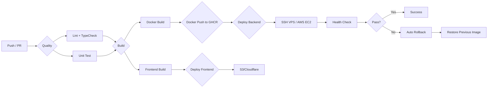

# HyperPush — CI/CD 部署流水线设计 v1

> 借鉴现有项目 `deploy-backend.yml` 的三阶段模式（quality → build → deploy）
> 以及 `rollback.sh` 的回滚策略，适配 HyperPush 的技术栈和双路径部署架构。

---

## 一、总览

HyperPush 包含 **后端（NestJS + Prisma + GraphQL）** 和 **前端（Vite + React + TanStack Router）** 两个部分。

### 部署场景

| 场景 | 后端 | 前端 | 数据库 |
|------|------|------|--------|
| VPS 部署 | Docker 容器 nginx 反代 | Docker 或 S3/CloudFront 静态 | Supabase 或 Docker PostgreSQL |
| AWS 部署 | ECR → EC2 容器 | S3 + CloudFront | Supabase PostgreSQL |
| 本地开发 | `bun run dev` | `bun run dev` | SQLite / Supabase |

---

## 二、GitHub Actions 工作流架构

### 2.1 整体流程



### 2.2 工作流文件

> ⚠️ **单体项目简化**：HyperPush 是 NestJS + Vite SPA 共存于同一仓库的单体项目，只需 **1 个 workflow 文件**。
> 通过条件步骤处理双路径部署（VPS / AWS），无需 `workflow_call` 子工作流。

| 文件 | 用途 | 触发方式 |
|------|------|----------|
| `.github/workflows/deploy-hyperpush.yml` | 单体部署：quality → build Docker → push → deploy VPS/AWS → health check → rollback | Push main / workflow_dispatch |

---

## 三、Quality 阶段（代码质量门禁）

借鉴现有项目 [`deploy-backend.yml:44-96`](.github/workflows/deploy-backend.yml:44)，但适配 bun。

```yaml
quality:
  runs-on: ubuntu-latest
  steps:
    - uses: actions/checkout@v4
    - uses: actions/setup-node@v4
      with:
        node-version: 20

    - name: Install bun
      run: npm install -g bun

    - name: Cache bun dependencies
      uses: actions/cache@v4
      with:
        path: |
          ~/.bun/install/cache
          node_modules
        key: bun-${{ hashFiles('bun.lock') }}
        restore-keys: bun-

    - name: Install dependencies
      run: bun install --frozen-lockfile

    - name: Generate Prisma Client
      run: bunx prisma generate

    - name: Lint + Type Check
      run: |
        bunx biome ci .
        bun run check-types
```

### 关键差异

| 项目 | 现有项目 | HyperPush |
|------|----------|-----------|
| 包管理器 | yarn + Corepack | bun install |
| Linter | ESLint | Biome |
| 构建 | webpack/turbo | Vite / tsc |
| 测试 | Jest | Vitest |
| 缓存 | yarn zip cache | bun cache |

---

## 四、Build 阶段 — Docker 构建 + 推送

### 4.1 Dockerfile 设计

借鉴现有项目 [`Dockerfile.prod`](Dockerfile.prod) 的三阶段模式，适配 HyperPush：

```dockerfile
# Stage 1: Builder
FROM node:20-alpine AS builder
WORKDIR /app

# bun 运行时需要
RUN npm install -g bun

COPY package.json bun.lock ./
COPY apps/api/package.json ./apps/api/package.json

RUN bun install --frozen-lockfile --production

COPY apps/api/ ./apps/api/
COPY packages/ ./packages/

# Prisma generate
RUN bunx prisma generate

# Build NestJS
RUN bun run build

# Stage 2: Production
FROM node:20-alpine AS production
WORKDIR /app

RUN apk add --no-cache openssl wget

COPY --from=builder /app/dist ./dist
COPY --from=builder /app/node_modules ./node_modules
COPY --from=builder /app/prisma ./prisma
COPY apps/api/docker/entrypoint.sh /entrypoint.sh

EXPOSE 3000
ENTRYPOINT ["/entrypoint.sh"]
```

### 4.2 GitHub Actions Build Job

借鉴 [`deploy-backend.yml:100-146`](.github/workflows/deploy-backend.yml:100)：

```yaml
build:
  needs: quality
  runs-on: ubuntu-latest
  permissions:
    contents: read
    packages: write
  steps:
    - uses: actions/checkout@v4
    - uses: docker/setup-buildx-action@v3
    - uses: docker/login-action@v3
      with:
        registry: ghcr.io
        username: ${{ github.actor }}
        password: ${{ secrets.GITHUB_TOKEN }}

    - name: Docker meta
      id: meta
      uses: docker/metadata-action@v5
      with:
        images: ghcr.io/${{ github.repository_owner }}/hyperpush-backend
        tags: |
          type=sha,prefix=
          type=raw,value=latest

    - name: Build & Push
      uses: docker/build-push-action@v6
      with:
        context: .
        file: ./Dockerfile
        push: true
        tags: ${{ steps.meta.outputs.tags }}
        cache-from: type=gha
        cache-to: type=gha,mode=max
```

---

## 五、Deploy 阶段 — 双路径部署

### 5.1 路径 A：VPS 部署（借鉴 deploy-backend.yml SSH 模式）

借鉴 [`deploy-backend.yml:151-363`](.github/workflows/deploy-backend.yml:151)：

```yaml
deploy-vps:
  needs: build
  runs-on: ubuntu-latest
  environment: production
  steps:
    - uses: actions/checkout@v4

    # SSH 前置检查
    - name: Validate SSH connectivity
      env:
        SSH_HOST: ${{ secrets.SSH_HOST }}
      run: |
        for i in 1 2 3; do
          if nc -zvw5 "$SSH_HOST" 22; then break; fi
          sleep 5
        done

    # 同步 deploy 脚本到 VPS
    - name: Sync deploy scripts
      uses: appleboy/scp-action@v0.1.7
      with:
        host: ${{ secrets.SSH_HOST }}
        username: ${{ secrets.SSH_USERNAME }}
        key: ${{ secrets.SSH_PRIVATE_KEY }}
        source: "deploy/*.sh"
        target: /opt/hyperpush/deploy
        overwrite: true

    # SSH 部署
    - name: Deploy via SSH
      uses: appleboy/ssh-action@v1.2.0
      env:
        GHCR_TOKEN: ${{ secrets.VPS_GHCR_PAT }}
        GHCR_USER: ${{ github.repository_owner }}
        IMAGE: ghcr.io/${{ github.repository_owner }}/hyperpush-backend:latest
      with:
        host: ${{ secrets.SSH_HOST }}
        username: ${{ secrets.SSH_USERNAME }}
        key: ${{ secrets.SSH_PRIVATE_KEY }}
        script: |
          set -e
          cd /opt/hyperpush

          # 1. 登录 GHCR
          echo "$GHCR_TOKEN" | docker login ghcr.io -u "$GHCR_USER" --password-stdin

          # 2. 拉取新镜像
          docker pull "$IMAGE"

          # 3. Prisma 迁移
          docker run --rm --env-file deploy/.env.prod \
            --entrypoint "" "$IMAGE" \
            ./node_modules/.bin/prisma migrate deploy

          # 4. 保存旧镜像 SHA（用于回滚）
          PREV_IMAGE=$(docker inspect hyperpush-backend \
            --format '{{.Image}}' 2>/dev/null || echo "")

          # 5. 重启后端
          BACKEND_IMAGE="$IMAGE" docker compose -f compose.prod.yml \
            --env-file deploy/.env.prod up -d --no-build --force-recreate backend

          # 6. 健康检查 + 自动回滚
          HEALTHY=false
          for i in $(seq 1 30); do
            if docker exec hyperpush-backend wget -qO- http://localhost:3000/health >/dev/null 2>&1; then
              HEALTHY=true
              break
            fi
            sleep 3
          done

          if [ "$HEALTHY" = false ]; then
            echo " Health check timeout! Rolling back..."
            if [ -n "$PREV_IMAGE" ]; then
              BACKEND_IMAGE="$PREV_IMAGE" docker compose -f compose.prod.yml \
                --env-file deploy/.env.prod up -d --no-build --force-recreate backend
            fi
            exit 1
          fi

          # 7. 清理
          docker image prune -f

    # 外部验证
    - name: Verify API externally
      run: |
        curl -sS --max-time 15 https://${{ secrets.API_DOMAIN }}/health
```

### 5.2 路径 B：AWS 部署（ECR + EC2）

```yaml
deploy-aws:
  needs: build
  runs-on: ubuntu-latest
  environment: production
  steps:
    - uses: actions/checkout@v4

    # 推送镜像到 ECR
    - name: Login to Amazon ECR
      uses: aws-actions/amazon-ecr-login@v2

    - name: Build, tag, and push to ECR
      env:
        ECR_REGISTRY: ${{ steps.login-ecr.outputs.registry }}
        ECR_REPOSITORY: hyperpush-backend
        IMAGE_TAG: ${{ github.sha }}
      run: |
        docker build -t $ECR_REGISTRY/$ECR_REPOSITORY:$IMAGE_TAG .
        docker tag $ECR_REGISTRY/$ECR_REPOSITORY:$IMAGE_TAG $ECR_REGISTRY/$ECR_REPOSITORY:latest
        docker push $ECR_REGISTRY/$ECR_REPOSITORY:$IMAGE_TAG
        docker push $ECR_REGISTRY/$ECR_REPOSITORY:latest

    # 部署到 EC2
    - name: Deploy to EC2
      uses: appleboy/ssh-action@v1.2.0
      with:
        host: ${{ secrets.AWS_EC2_HOST }}
        username: ec2-user
        key: ${{ secrets.AWS_SSH_PRIVATE_KEY }}
        script: |
          aws ecr get-login-password | docker login --username AWS --password-stdin ${{ secrets.AWS_ECR_REGISTRY }}
          docker pull ${{ secrets.AWS_ECR_REGISTRY }}/hyperpush-backend:latest
          docker compose -f compose.prod.yml up -d --no-build --force-recreate backend
```

### 5.3 前端部署

如果前端是 SPA，可以部署到 S3 + CloudFront（AWS 路径）或 Nginx 静态目录（VPS 路径）：

```yaml
deploy-frontend:
  runs-on: ubuntu-latest
  steps:
    - uses: actions/checkout@v4
    - uses: actions/setup-node@v4
    - name: Install bun
      run: npm install -g bun
    - name: Install deps
      run: bun install --frozen-lockfile
    - name: Build frontend
      run: bun run build

    # AWS 路径：S3 + CloudFront
    - name: Deploy to S3
      if: ${{ inputs.target == 'aws' }}
      uses: jakejarvis/s3-sync-action@master
      with:
        args: --delete
      env:
        AWS_S3_BUCKET: ${{ secrets.AWS_S3_BUCKET }}
        AWS_ACCESS_KEY_ID: ${{ secrets.AWS_ACCESS_KEY_ID }}
        AWS_SECRET_ACCESS_KEY: ${{ secrets.AWS_SECRET_ACCESS_KEY }}
        SOURCE_DIR: "dist"

    - name: Invalidate CloudFront
      if: ${{ inputs.target == 'aws' }}
      uses: chetan/invalidate-cloudfront-action@v2
      env:
        DISTRIBUTION: ${{ secrets.CLOUDFRONT_DISTRIBUTION_ID }}
        PATHS: "/*"

    # VPS 路径：SCP 到 Nginx 目录
    - name: Deploy to VPS
      if: ${{ inputs.target == 'vps' }}
      uses: appleboy/scp-action@v0.1.7
      with:
        host: ${{ secrets.SSH_HOST }}
        username: ${{ secrets.SSH_USERNAME }}
        key: ${{ secrets.SSH_PRIVATE_KEY }}
        source: "dist/*"
        target: /opt/hyperpush/nginx/html
        strip_components: 1
        overwrite: true
```

---

## 六、回滚策略

### 6.1 自动回滚（CI 内）

借鉴 [`deploy-backend.yml:335-347`](.github/workflows/deploy-backend.yml:335)：

在 Deploy 阶段的 SSH 脚本中内置：

```bash
# 部署新镜像前保存旧镜像 SHA
PREV_IMAGE=$(docker inspect hyperpush-backend \
  --format '{{.Image}}' 2>/dev/null || echo "")

# 启动新容器...

# 健康检查超时 → 自动回滚
if [ "$HEALTHY" = false ]; then
  if [ -n "$PREV_IMAGE" ]; then
    BACKEND_IMAGE="$PREV_IMAGE" docker compose -f compose.prod.yml \
      --env-file deploy/.env.prod up -d --no-build --force-recreate backend
  fi
  exit 1
fi
```

### 6.2 手动回滚脚本

借鉴 [`deploy/rollback.sh`](deploy/rollback.sh)：

```bash
# deploy/rollback.sh
set -euo pipefail

VPS_IP="${VPS_IP:-}"
if [ -z "$VPS_IP" ]; then
    read -rp "请输入 VPS IP 地址: " VPS_IP
fi

SSH_TARGET="root@${VPS_IP}"

# SSH 连通性检查
ssh -o ConnectTimeout=5 "$SSH_TARGET" "echo 'SSH OK'"

# 容器回滚
ssh "$SSH_TARGET" << 'SCRIPT'
    set -e
    cd /opt/hyperpush

    echo "→ 当前镜像列表:"
    docker images --format "table {{.Repository}}\t{{.Tag}}\t{{.CreatedAt}}"

    echo "→ 重启服务 (使用上一个可用镜像)..."
    docker compose -f compose.prod.yml \
      --env-file deploy/.env.prod up -d --no-build --force-recreate

    echo "→ 等待服务健康..."
    sleep 8
    docker compose -f compose.prod.yml ps
SCRIPT
```

### 6.3 数据库回滚

如果是 Prisma 迁移回滚：

```bash
# deploy/db-rollback.sh
npx prisma migrate resolve --rolled-back "migration_name"
# 或恢复到某个时间点的备份
```

> 注：Supabase 提供 Point-in-Time Recovery（PITR），可以直接通过 Supabase Dashboard 回滚。

---

## 七、通知机制

借鉴 [`deploy-backend.yml:422-451`](.github/workflows/deploy-backend.yml:422) 的 Telegram 通知：

```yaml
- name: Send Telegram Notification
  if: always()
  run: |
    if [ "${{ job.status }}" = "success" ]; then
      STATUS=" Success"
    else
      STATUS=" Failed"
    fi

    MESSAGE="HyperPush Deployment Report
    Status: $STATUS
    Branch: ${{ github.ref_name }}
    Commit: ${{ github.sha }}"

    curl -s -X POST "https://api.telegram.org/bot${{ secrets.TELEGRAM_TOKEN }}/sendMessage" \
      -d "chat_id=${{ secrets.TELEGRAM_CHAT_ID }}" \
      -d "text=$MESSAGE" \
      -d "parse_mode=Markdown"
```

---

## 八、所需 GitHub Secrets

| Secret | 用途 | 必填 |
|--------|------|------|
| `SSH_HOST` | VPS IP 地址 | VPS 路径 |
| `SSH_USERNAME` | VPS SSH 用户名 | VPS 路径 |
| `SSH_PRIVATE_KEY` | SSH 私钥 | VPS 路径 |
| `VPS_GHCR_PAT` | GHCR 读取令牌（VPS 用） | VPS 路径 |
| `TELEGRAM_TOKEN` | Telegram Bot Token | 可选 |
| `TELEGRAM_CHAT_ID` | Telegram 通知目标 | 可选 |
| `AWS_ACCESS_KEY_ID` | AWS 访问密钥 | AWS 路径 |
| `AWS_SECRET_ACCESS_KEY` | AWS 密钥 | AWS 路径 |
| `AWS_ECR_REGISTRY` | ECR 注册地址 | AWS 路径 |
| `AWS_S3_BUCKET` | S3 存储桶名称 | AWS 路径 |
| `CLOUDFRONT_DISTRIBUTION_ID` | CloudFront 分发 ID | AWS 路径 |
| `AWS_EC2_HOST` | EC2 实例地址 | AWS 路径 |
| `AWS_SSH_PRIVATE_KEY` | EC2 SSH 私钥 | AWS 路径 |
| `API_DOMAIN` | API 域名（外网验证） | 可选 |

---

## 九、部署目录结构（VPS）

```
/opt/hyperpush/
├── compose.prod.yml          # Docker Compose（生产者）
├── deploy/
│   ├── .env.prod             # 环境变量
│   ├── deploy.sh             # 本地部署脚本
│   └── rollback.sh           # 回滚脚本
├── nginx/
│   └── nginx.prod.conf       # Nginx 配置
├── certs/                    # SSL 证书
└── backups/                  # 数据库备份
```

---

## 十、与现有项目的差异总结

| 特性 | 现有项目（JoyMini） | HyperPush |
|------|--------------------|-----------|
| 包管理器 | yarn 4.9.2 | bun install |
| Linter | ESLint | Biome |
| 构建 | webpack + tsc | Vite + tsc |
| Docker registry | GHCR | GHCR + ECR |
| 数据库 | 自建 PostgreSQL | Supabase PostgreSQL |
| 迁移工具 | Prisma | Prisma |
| 回滚 | Docker compose up --no-build | 同上 + Supabase PITR |
| 通知 | Telegram | Telegram |
| 前端部署 | Cloudflare Workers | S3 + CloudFront / Nginx |
| SSH 工具 | appleboy/scp-action + ssh-action | 相同 |

---

## 十一、实施步骤

1. 创建 `.github/workflows/deploy-hyperpush.yml` — 主工作流
2. 创建 `Dockerfile` — 多阶段构建
3. 创建 `compose.prod.yml` — 生产 Docker Compose
4. 创建 `deploy/deploy.sh` — 本地部署脚本
5. 创建 `deploy/rollback.sh` — 回滚脚本
6. 配置 GitHub Secrets
7. 配置 Supabase 项目（生产环境）
8. 测试 CI/CD 流水线：push → build → deploy → verify
