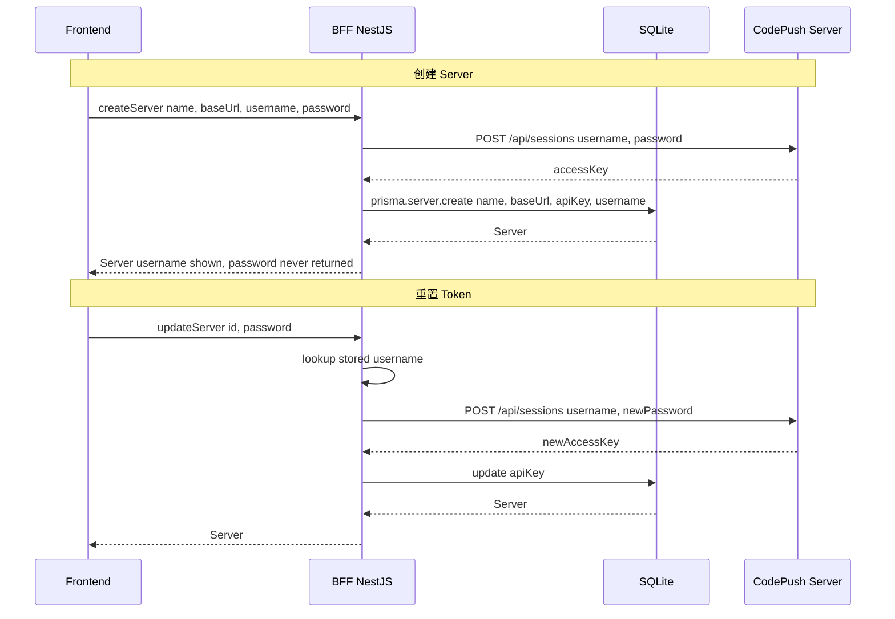

# CodePush Token 自动化集成 — 实施计划

## 架构变化

**Before:** 用户手动粘贴 CodePush apiKey → 直接存 DB → BFF 用 apiKey 发代理请求

**After:** 用户输入 CodePush username+password → BFF 调用 `POST {baseUrl}/api/sessions` → 拿到 accessKey → 存到 `apiKey` 字段 → BFF 用存储的 accessKey 发代理请求

**关键规则:**
- `password` 永不入库 — 只在 create/update 时通过 DTO 传入
- `apiKey` 字段名不变 — 语义从"用户输入的凭据"变为"后端自动获取的 accessKey"
- `username` 需要持久化 — 用于展示和 token 重置
- GraphQL 保留作为 API 接口层

---

## 任务列表 (按执行顺序)

### 第 1 组: 数据库层
- [ ] **1a. Prisma Schema** — `prisma/schema.prisma:23-33`
  - Server model 添加 `username String` 字段
  - 执行 `npx prisma migrate dev --name add-server-username`
  - 然后 `npx prisma generate`

### 第 2 组: 后端 DTO 层
- [ ] **2a. CreateServerInput** — `src/servers/dto/create-server.input.ts`
  - `apiKey: string` → `username: string` + `password: string`
- [ ] **2b. UpdateServerInput** — `src/servers/dto/update-server.input.ts`
  - 添加可选 `username?: string` + `password?: string`
  - 保持 `apiKey?: string` 向后兼容（但前端不再发送）

### 第 3 组: 后端 Service 层
- [ ] **3a. ServersService.create()** — `src/servers/servers.service.ts:27-34`
  - 调用 `POST {baseUrl}/api/sessions` 获取 accessKey
  - 用返回的 accessKey 作为 `apiKey` 存储
  - 存储 `username` 但不存 `password`
  - 使用原生 `fetch`（无需额外依赖）
- [ ] **3b. ServersService.update()** — `src/servers/servers.service.ts:36-42`
  - 如果提供了 `password`，用存储的 `username` + 新 `password` re-login
  - 更新 `apiKey` 为新 accessKey
  - 如果提供了 `username`，更新存储的 username

### 第 4 组: GraphQL Resolver 层
- [ ] **4a. 创建 ServersResolver** — `src/servers/servers.resolver.ts` (新文件)
  - `servers` query
  - `server(id)` query
  - `createServer(input)` mutation
  - `updateServer(input)` mutation
  - `deleteServer(id)` mutation
- [ ] **4b. 注册 Resolver** — `src/servers/servers.module.ts`
  - 将 ServersResolver 加入 providers
- [ ] **4c. 移除占位** — `src/app.module.ts`
  - 移除 AppResolver（可选，保留也无害）

### 第 5 组: 前端类型层
- [ ] **5a. Server 模型** — `src/app/types/models.ts:27-36`
  - 添加 `username: string` 字段
- [ ] **5b. GraphQL 类型** — `src/app/types/graphql.ts:73-91`
  - `CreateServerMutationVariables.input`: `apiKey` → `username` + `password`
  - `UpdateServerMutationVariables.input`: 添加可选 `username` + `password`

### 第 6 组: 前端页面层
- [ ] **6a. ServersPage** — `src/app/routes/dashboard/ServersPage.tsx`
  - 引入 shadcn Dialog (已安装)
  - 创建表单: name + baseUrl + username + password
  - 启用 Add Server 按钮
  - onSubmit 调用 createServer mutation
- [ ] **6b. ServerDetailPage** — `src/app/routes/dashboard/ServerDetailPage.tsx`
  - 显示 `username` (read-only) 代替 editable apiKey
  - 显示连接状态徽章 (Online/Offline)
  - 添加 Reset Token 按钮 (打开含 password 字段的 dialog)
  - Edit 模式包含可选的 password 字段用于 re-login

### 第 7 组: 验证
- [ ] **7a. TypeScript 检查** — `npx tsc --noEmit`
- [ ] **7b. Vite 构建** — `bun run build:frontend`
- [ ] **7c. NestJS 构建** — `bun run build:backend`

---

## 数据流图

## 文件变更清单

| 文件 | 操作 | 变更内容 |
|------|------|----------|
| `prisma/schema.prisma` | 修改 | Server 加 username 字段 |
| `src/servers/dto/create-server.input.ts` | 修改 | apiKey → username+password |
| `src/servers/dto/update-server.input.ts` | 修改 | 加 username+password |
| `src/servers/servers.service.ts` | 修改 | create/update 加 CodePush 登录 |
| `src/servers/servers.resolver.ts` | **新建** | GraphQL resolver |
| `src/servers/servers.module.ts` | 修改 | 注册 resolver |
| `src/app/types/models.ts` | 修改 | Server 加 username |
| `src/app/types/graphql.ts` | 修改 | Create/Update input 类型 |
| `src/app/routes/dashboard/ServersPage.tsx` | 修改 | Dialog + 表单 |
| `src/app/routes/dashboard/ServerDetailPage.tsx` | 修改 | username + 状态 + Reset Token |
