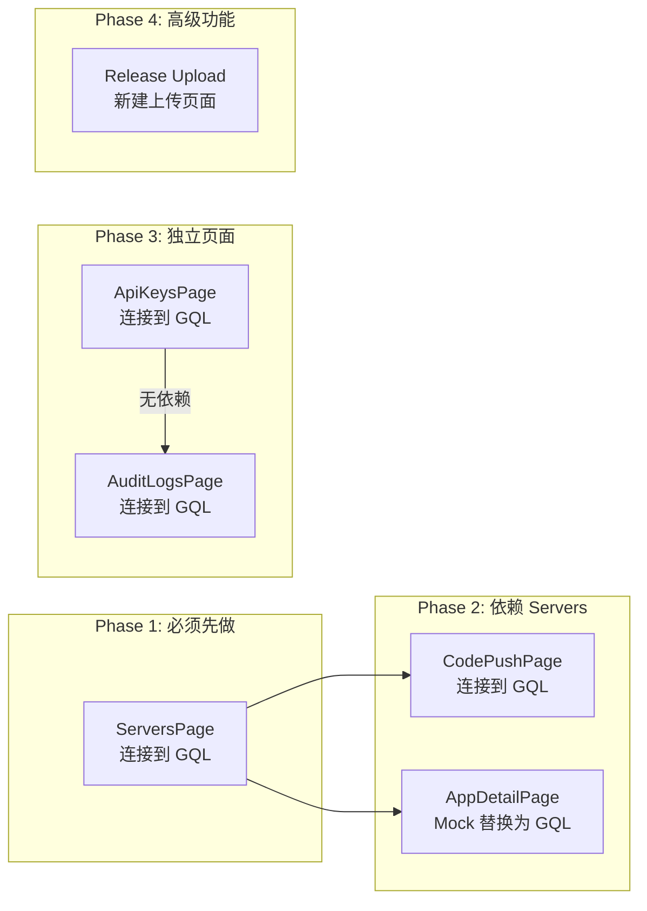

# HyperPush 前端-后端功能对齐报告

> 日期: 2026-05-26
> 状态: 后端 100% 完成，前端 UI 壳存在但未对接 GraphQL

---

## 一、总览

| 模块 | 后端状态 | 前端 UI 壳 | 前端真实数据 | 差距 |
|------|---------|-----------|------------|------|
| Auth (登录/注册) | ✅ 完整 | ✅ LoginPage + RegisterPage | ✅ 已对接 Redux + Apollo | ✅ 无差距 |
| Servers CRUD | ✅ 完整 | ✅ ServersPage (含 dialog 表单) | ❌ `console.log` + 占位符 | ⚠️ 需连接 GQL |
| ApiKeys CRUD | ✅ 完整 | ✅ ApiKeysPage | ❌ 纯占位符 "No API keys yet" | ⚠️ 需连接 GQL |
| AuditLog | ✅ 完整 | ✅ AuditLogsPage | ❌ 纯占位符 "No audit logs yet" | ⚠️ 需连接 GQL |
| CodePush Apps | ✅ 完整 (28 GQL endpoints) | ✅ CodePushPage | ❌ 纯占位符 | ⚠️ 需连接 GQL |
| App Detail (Deployments/Releases/AccessKeys) | ✅ 完整 | ✅ AppDetailPage (Tabs 完整) | ❌ Mock 数据 | ⚠️ 需替换为真实 GQL |
| Release Upload (multipart) | ✅ CodepushController | ❌ 无上传 UI | ❌ | ❌ 无 UI |

**结论**: 前端 6 个页面中，只有 Login/Register 是真实对接的，其余 4 个页面 + 1 个详情页都只完成了 UI 壳，没有调用真实的 GraphQL API。

---

## 二、基础设施状态 (已就绪，不需改动)

| 项目 | 文件 | 状态 |
|------|------|------|
| Apollo Client | [`apollo.ts`](../frontend/src/app/lib/apollo.ts) | ✅ 已配置 auth link + cache |
| Apollo Provider | [`main.tsx`](../frontend/src/app/main.tsx:27) | ✅ 已包裹 `<ApolloProvider>` |
| GQL 类型接口 | [`graphql.ts`](../frontend/src/app/types/graphql.ts) | ✅ 全部已定义 (235 行) |
| 数据模型 | [`models.ts`](../frontend/src/app/types/models.ts) | ✅ 全部已定义 (156 行) |
| Redux Auth | [`authSlice.ts`](../frontend/src/app/store/slices/authSlice.ts) | ✅ login/logout/setUser 完整 |
| 路由守卫 | [`router.ts`](../frontend/src/app/router.ts) | ✅ BeforeLoad 检查 token |

---

## 三、每个页面的具体差距

### 3.1 ServersPage — [`ServersPage.tsx`](../frontend/src/app/routes/dashboard/ServersPage.tsx)

**当前状态**:
- 创建 Server 的 Dialog 表单 UI ✅ (name/baseUrl/username/password 字段)
- `handleSubmit` 中只有 `console.log('Create server:', form)` ❌
- Server 列表区域显示 "No servers yet" 占位符 ❌

**需要对接的 GQL**:
| GQL Operation | 用途 | 后端 Resolver |
|--------------|------|--------------|
| `GET_SERVERS` | 查询服务器列表 | `serversResolver.getServers()` |
| `CREATE_SERVER` | 创建服务器 (含 CodePush 登录) | `serversResolver.createServer()` |
| `DELETE_SERVER` | 删除服务器 | `serversResolver.deleteServer()` |

**工作量**: ~80 行 (gql 查询 + useQuery + useMutation + 列表渲染)

### 3.2 CodePushPage — [`CodePushPage.tsx`](../frontend/src/app/routes/dashboard/CodePushPage.tsx)

**当前状态**:
- CardHeader + "Create App" button (disabled) ✅
- "No CodePush apps yet" 占位符 ❌

**需要对接的 GQL** (28 个 endpoints 中的核心):
| GQL Operation | 用途 | 后端 Resolver |
|--------------|------|--------------|
| `GET_CODEPUSH_APPS` | 查询应用列表 | `codepushResolver.codepushApps()` |
| `CREATE_CODEPUSH_APP` | 创建应用 | `codepushResolver.createCodepushApp()` |
| `DELETE_CODEPUSH_APP` | 删除应用 | `codepushResolver.deleteCodepushApp()` |

**工作量**: ~100 行 (列表 + 创建/删除 dialog)

### 3.3 AppDetailPage — [`AppDetailPage.tsx`](../frontend/src/app/routes/dashboard/AppDetailPage.tsx)

**当前状态**:
- 三个 Tabs: Deployments / Releases / Access Keys ✅
- Back button + 状态徽标 + 格式化函数 ✅
- **全部使用 Mock 数据** (`mockDeployments`, `mockReleases`, `mockAccessKeys`) ❌

**需要对接的 GQL**:
| GQL Operation | 用途 | 后端 Resolver |
|--------------|------|--------------|
| `GET_DEPLOYMENTS` | 查询部署列表 | `codepushResolver.codepushDeployments()` |
| `CREATE_DEPLOYMENT` | 创建部署 | `codepushResolver.createCodepushDeployment()` |
| `DELETE_DEPLOYMENT` | 删除部署 | `codepushResolver.deleteCodepushDeployment()` |
| `GET_RELEASES` | 查询发布历史 | `codepushResolver.codepushReleaseHistory()` |
| `PROMOTE_RELEASE` | 提升发布 | `codepushResolver.promoteCodepushRelease()` |
| `ROLLBACK_RELEASE` | 回滚发布 | `codepushResolver.rollbackCodepushRelease()` |
| `GET_ACCESS_KEYS` | 查询访问密钥 | `codepushResolver.codepushAccessKeys()` |
| `CREATE_ACCESS_KEY` | 创建访问密钥 | `codepushResolver.createCodepushAccessKey()` |
| `DELETE_ACCESS_KEY` | 删除访问密钥 | `codepushResolver.deleteCodepushAccessKey()` |

**工作量**: ~200 行 (替换 mock → useQuery + useMutation + loading states)

### 3.4 ApiKeysPage — [`ApiKeysPage.tsx`](../frontend/src/app/routes/dashboard/ApiKeysPage.tsx)

**当前状态**:
- CardHeader + "Create Key" button (disabled) ✅
- "No API keys yet" 占位符 ❌

**需要对接的 GQL**:
| GQL Operation | 用途 | 后端 Resolver |
|--------------|------|--------------|
| `GET_API_KEYS` | 查询 API 密钥列表 | `apiKeysResolver.getApiKeys()` |
| `CREATE_API_KEY` | 创建密钥 | `apiKeysResolver.createApiKey()` |
| `DELETE_API_KEY` | 删除密钥 | `apiKeysResolver.deleteApiKey()` |

**工作量**: ~80 行

### 3.5 AuditLogsPage — [`AuditLogsPage.tsx`](../frontend/src/app/routes/dashboard/AuditLogsPage.tsx)

**当前状态**:
- CardHeader + "Filter" button (disabled) ✅
- "No audit logs yet" 占位符 ❌

**需要对接的 GQL**:
| GQL Operation | 用途 | 后端 Resolver |
|--------------|------|--------------|
| `GET_AUDIT_LOGS` | 查询审计日志 | `auditLogResolver.getAuditLogs()` |

**工作量**: ~60 行 (列表 + 筛选 UI)

### 3.6 Release Upload — 无前端页面

**当前状态**: 后端有 [`CodepushController`](../backend/src/codepush/codepush.controller.ts) 提供 `POST /api/codepush/upload/:serverId/:appName/:deploymentName` 用于上传 zip 包，但前端没有任何上传 UI。

**工作量**: ~100 行 (上传 Dialog + FormData 构建 + 进度条)

---

## 四、依赖关系 — 先做哪个

**原因**: ServersPage 是入口 — 必须先添加一个 CodePush 服务器，然后才能浏览它的 Apps/Deployments/Releases。

---

## 五、总结

| 页面 | 当前 | 目标 | 工作量 |
|------|------|------|--------|
| ServersPage | UI shell + console.log | 真实 GQL CRUD | ~80 行 |
| CodePushPage | 占位符 | App 列表 + CRUD | ~100 行 |
| AppDetailPage | Mock 数据 | 3 tabs 真实 GQL | ~200 行 |
| ApiKeysPage | 占位符 | 真实 GQL CRUD | ~80 行 |
| AuditLogsPage | 占位符 | 列表 + 筛选 | ~60 行 |
| Release Upload | 不存在 | 新建上传页面 | ~100 行 |
| **合计** | **0% 对接** | **100% 对接** | **~620 行** |

**后端已全部就绪** (所有 Resolver 运行正确，Docker 容器 Healthy)。前端只需要在现有 UI 壳上插入 `useQuery` / `useMutation` 来调用后端 GraphQL API，无需修改后端代码。
