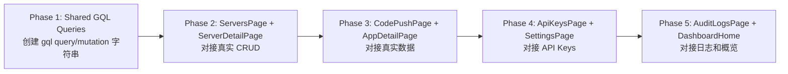

# Frontend — 8 个页面对接真实 GraphQL 数据

> 执行模式: Code
> 依赖: 后端 Docker 容器已在运行 (http://localhost:3000/graphql)
> 注意: 所有页面已在目录分离后位于 frontend/ 目录下

---

## 执行顺序



---

## Phase 1: 创建共享 GQL 查询文件

### 文件: [`frontend/src/app/lib/queries.ts`](../frontend/src/app/lib/queries.ts) (新建)

把所有的 `gql` 查询字符串集中到一个文件里，供所有页面引用。

```typescript
import { gql } from '@apollo/client';

// ─── Auth ───────────────────────────────────────
export const LOGIN_MUTATION = gql`
  mutation Login($input: LoginInput!) {
    login(input: $input) {
      token
      user { id email name role createdAt updatedAt }
    }
  }
`;

export const REGISTER_MUTATION = gql`
  mutation Register($input: RegisterInput!) {
    register(input: $input) {
      token
      user { id email name role createdAt updatedAt }
    }
  }
`;

export const ME_QUERY = gql`
  query Me {
    me { id email name role createdAt updatedAt }
  }
`;

// ─── Servers ────────────────────────────────────
export const GET_SERVERS = gql`
  query GetServers {
    getServers {
      id name baseUrl username apiKey isOnline userId createdAt updatedAt
    }
  }
`;

export const GET_SERVER = gql`
  query GetServer($id: String!) {
    server(id: $id) {
      id name baseUrl username apiKey isOnline userId createdAt updatedAt
    }
  }
`;

export const CREATE_SERVER = gql`
  mutation CreateServer($input: CreateServerInput!) {
    createServer(input: $input) {
      id name baseUrl username apiKey isOnline userId createdAt updatedAt
    }
  }
`;

export const UPDATE_SERVER = gql`
  mutation UpdateServer($input: UpdateServerInput!) {
    updateServer(input: $input) {
      id name baseUrl username apiKey isOnline userId createdAt updatedAt
    }
  }
`;

export const DELETE_SERVER = gql`
  mutation DeleteServer($id: String!) {
    deleteServer(id: $id)
  }
`;

// ─── ApiKeys ────────────────────────────────────
export const GET_API_KEYS = gql`
  query GetApiKeys {
    getApiKeys {
      id name key userId createdAt
    }
  }
`;

export const CREATE_API_KEY = gql`
  mutation CreateApiKey($input: CreateApiKeyInput!) {
    createApiKey(input: $input) {
      id name key userId createdAt
    }
  }
`;

export const DELETE_API_KEY = gql`
  mutation DeleteApiKey($id: String!) {
    deleteApiKey(id: $id)
  }
`;

// ─── AuditLogs ──────────────────────────────────
export const GET_AUDIT_LOGS = gql`
  query GetAuditLogs($filter: AuditLogFilterInput) {
    getAuditLogs(filter: $filter) {
      id action entity entityId detail userId createdAt
    }
  }
`;

// ─── CodePush Apps ──────────────────────────────
export const GET_CODEPUSH_APPS = gql`
  query CodepushApps($serverId: String!) {
    codepushApps(serverId: $serverId) {
      ... on JSON { }
    }
  }
`;

export const CREATE_CODEPUSH_APP = gql`
  mutation CreateCodepushApp($input: CreateAppInput!) {
    createCodepushApp(input: $input)
  }
`;

export const DELETE_CODEPUSH_APP = gql`
  mutation DeleteCodepushApp($id: String!) {
    deleteCodepushApp(id: $id)
  }
`;

// ─── CodePush Deployments ───────────────────────
export const GET_CODEPUSH_DEPLOYMENTS = gql`
  query CodepushDeployments($appId: String!, $serverId: String!) {
    codepushDeployments(appId: $appId, serverId: $serverId)
  }
`;

export const CREATE_CODEPUSH_DEPLOYMENT = gql`
  mutation CreateCodepushDeployment($appId: String!, $name: String!, $serverId: String!) {
    createCodepushDeployment(appId: $appId, name: $name, serverId: $serverId)
  }
`;

export const DELETE_CODEPUSH_DEPLOYMENT = gql`
  mutation DeleteCodepushDeployment($appId: String!, $deploymentName: String!, $serverId: String!) {
    deleteCodepushDeployment(appId: $appId, deploymentName: $deploymentName, serverId: $serverId)
  }
`;

// ─── CodePush Releases ──────────────────────────
export const GET_CODEPUSH_RELEASE_HISTORY = gql`
  query CodepushReleaseHistory($appId: String!, $deploymentName: String!, $serverId: String!) {
    codepushReleaseHistory(appId: $appId, deploymentName: $deploymentName, serverId: $serverId)
  }
`;

export const PROMOTE_CODEPUSH_RELEASE = gql`
  mutation PromoteCodepushRelease($input: PromoteReleaseInput!) {
    promoteCodepushRelease(input: $input)
  }
`;

export const ROLLBACK_CODEPUSH_RELEASE = gql`
  mutation RollbackCodepushRelease($appId: String!, $deploymentName: String!, $serverId: String!) {
    rollbackCodepushRelease(appId: $appId, deploymentName: $deploymentName, serverId: $serverId)
  }
`;

// ─── CodePush Access Keys ───────────────────────
export const GET_CODEPUSH_ACCESS_KEYS = gql`
  query CodepushAccessKeys($serverId: String!) {
    codepushAccessKeys(serverId: $serverId)
  }
`;

export const CREATE_CODEPUSH_ACCESS_KEY = gql`
  mutation CreateCodepushAccessKey($input: CreateAccessKeyInput!) {
    createCodepushAccessKey(input: $input)
  }
`;

export const DELETE_CODEPUSH_ACCESS_KEY = gql`
  mutation DeleteCodepushAccessKey($id: String!) {
    deleteCodepushAccessKey(id: $id)
  }
`;
```

---

## Phase 2: ServersPage + ServerDetailPage

### 2.1 [`ServersPage.tsx`](../frontend/src/app/routes/dashboard/ServersPage.tsx)

**改动点**:
1. 顶部导入: `import { useQuery, useMutation } from '@apollo/client';` + 从 `../lib/queries` 导入 `GET_SERVERS`, `CREATE_SERVER`, `DELETE_SERVER`
2. 添加 `const { data, loading, refetch } = useQuery(GET_SERVERS);`
3. 添加 `const [createServer] = useMutation(CREATE_SERVER);`
4. 添加 `const [deleteServer] = useMutation(DELETE_SERVER);`
5. 替换 `handleSubmit` 中的 `console.log` 为真实 `createServer()` 调用 + `refetch()`
6. 替换 Card 中的 "No servers yet" 占位符为服务器列表渲染 (使用 `data?.getServers`)
7. 每个服务器项添加点击导航到 `/dashboard/servers/$id`
8. 添加 loading 和 error 状态

### 2.2 [`ServerDetailPage.tsx`](../frontend/src/app/routes/dashboard/ServerDetailPage.tsx)

**改动点**:
1. 导入 `useQuery`, `useMutation` + `GET_SERVER`, `UPDATE_SERVER`, `DELETE_SERVER`
2. 删除 `mockServer` 和 `connectionHistory` mock 数据
3. 添加 `const { data, loading, error } = useQuery(GET_SERVER, { variables: { id: params.id } });`
4. 添加 `const [updateServer] = useMutation(UPDATE_SERVER);`
5. 添加 `const [deleteServer] = useMutation(DELETE_SERVER);`
6. 替换 `handleSave` 中的 console.log 为真实 updateServer 调用
7. 替换 `handleDelete` 中的 console.log 为真实 deleteServer 调用
8. 替换 `handleResetToken` 中的 console.log 为真实 updateServer (password-only) 调用
9. 所有数据从 `data?.server` 获取，不再用 mock
10. 添加 loading skeleton 和 error 状态

---

## Phase 3: CodePushPage + AppDetailPage

### 3.1 [`CodePushPage.tsx`](../frontend/src/app/routes/dashboard/CodePushPage.tsx)

**改动点**:
1. 导入 `useQuery`, `useMutation` + `GET_CODEPUSH_APPS`, `CREATE_CODEPUSH_APP`, `DELETE_CODEPUSH_APP`
2. 需要先选择一个 server (因为 Apps 是 per-server 的)
3. 添加 Server 选择器 dropdown (从 GET_SERVERS 获取列表)
4. 当选中 server 后，调用 `GET_CODEPUSH_APPS` 获取 app 列表
5. 添加创建 App 的 Dialog (名称 + 平台选择)
6. 每个 App 项可点击导航到 `/dashboard/codepush/$appId`
7. 添加删除确认 Dialog

### 3.2 [`AppDetailPage.tsx`](../frontend/src/app/routes/dashboard/AppDetailPage.tsx)

**改动点**:
1. 删除所有 mock 数据 (`mockDeployments`, `mockReleases`, `mockAccessKeys`)
2. 导入 `useQuery`, `useMutation` + 所有 CodePush GQL 查询
3. 从路由参数获取 `appId`，从 search params 获取 `serverId`
4. **Deployments Tab**: `useQuery(GET_CODEPUSH_DEPLOYMENTS)` + 创建/删除
5. **Releases Tab**: `useQuery(GET_CODEPUSH_RELEASE_HISTORY)` + promote/rollback
6. **Access Keys Tab**: `useQuery(GET_CODEPUSH_ACCESS_KEYS)` + 创建/删除
7. 添加 loading/error/empty 状态处理

---

## Phase 4: ApiKeysPage + SettingsPage

### 4.1 [`ApiKeysPage.tsx`](../frontend/src/app/routes/dashboard/ApiKeysPage.tsx)

**改动点**:
1. 导入 `useQuery`, `useMutation` + `GET_API_KEYS`, `CREATE_API_KEY`, `DELETE_API_KEY`
2. 添加 `const { data, loading, refetch } = useQuery(GET_API_KEYS);`
3. 添加创建 Dialog (名称 + 过期时间)
4. 添加删除确认
5. 渲染 key 列表 (显示 key 的前缀 + 拷贝按钮)
6. 添加 loading/empty 状态

### 4.2 [`SettingsPage.tsx`](../frontend/src/app/routes/dashboard/SettingsPage.tsx)

**额外注意**: Settings 比较特殊，已经有较复杂的 UI (Profile 表单 + API Keys 管理)。Settings 页面的 API Keys 部分和 ApiKeysPage 功能重叠，需要注意数据同步。

**改动点**:
1. Profile 表单: 用 `ME_QUERY` 获取当前用户数据，对接一个 profile update mutation (如果后端有)
2. API Keys 部分: 和 ApiKeysPage 一样使用 `GET_API_KEYS`, `CREATE_API_KEY`, `DELETE_API_KEY`
3. 删除 mock 数据，用真实 GQL 替换

---

## Phase 5: AuditLogsPage + DashboardHome

### 5.1 [`AuditLogsPage.tsx`](../frontend/src/app/routes/dashboard/AuditLogsPage.tsx)

**改动点**:
1. 导入 `useQuery` + `GET_AUDIT_LOGS`
2. 添加 `const { data, loading } = useQuery(GET_AUDIT_LOGS, { variables: { filter } });`
3. 添加筛选 UI (按 entity/action 筛选, 使用 useState 管理 filter 状态)
4. 渲染日志列表 (时间线风格或表格)
5. 启用 "Filter" 按钮
6. 添加 loading/empty 状态

### 5.2 [`DashboardHome.tsx`](../frontend/src/app/routes/dashboard/DashboardHome.tsx)

**改动点**:
1. 导入 `useQuery` + `GET_SERVERS`, `GET_API_KEYS`, `GET_AUDIT_LOGS`, `GET_CODEPUSH_APPS`
2. 把 `value: '--'` 替换为从查询结果计算的实际计数
3. 例如: `servers.length`, `apiKeys.length`, `auditLogs.length`, `apps.length`

---

## 关键注意事项

### 1. GQL Query 名称必须匹配后端 Resolver
后端 resolver 方法名就是 GQL query/mutation 名称。例如 `getServers` 而不是 `servers`。

### 2. Codepush Resolver 返回 JSON 类型
Codepush Resolver 中所有 query/mutation 返回 `GraphQLJSON` 类型，所以前端查询时用 `... on JSON { }` 或直接不用指定具体字段。

### 3. GraphQL 参数类型
后端参数名和前端变量名必须匹配。例如 `$serverId: String!` 对应后端的 `@Args('serverId') serverId: string`。

### 4. 部署验证
每个 Phase 完成后，建议 `docker compose restart frontend` 来验证前端容器能正常编译和启动。

### 5. 不要修改后端代码
所有改动只在 `frontend/` 目录下进行。后端已经就绪且经过 Docker 验证。
