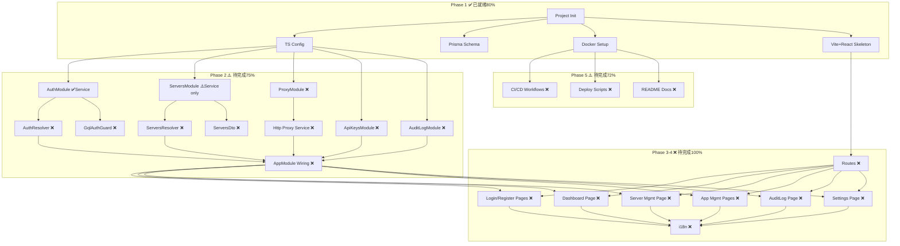

# HyperPush 基础设施评估报告

> 评估日期：2026-05-24
> 对照文档：[`plans/codepush-admin-architecture.md`](plans/codepush-admin-architecture.md)、[`plans/codepush-console-schedule.md`](plans/codepush-console-schedule.md)

---

## 一、总体进度概览

| 阶段 | 计划项 | 已完成 | 完成率 |
|------|--------|--------|--------|
| **Phase 1: 项目骨架** | 5 项 | 4 项 | **80%** |
| **Phase 2: BFF 后端** | 6 项 | 1.5 项 | **25%** |
| **Phase 3: 前端页面** | 11 项 | 0 项 | **0%** |
| **Phase 4: i18n + 异常处理** | 5 项 | 0 项 | **0%** |
| **Phase 5: 部署 + CI/CD** | 7 项 | 2 项 | **28%** |
| **总计** | **34 项** | **~7.5 项** | **~22%** |

---

## 二、各模块详细评估

### ✅ 已经就绪的（Solid Foundation）

| 模块 | 状态 | 说明 |
|------|------|------|
| **项目结构** | ✅ 稳固 | NestJS + Vite 同仓，目录结构清晰 |
| **TypeScript** | ✅ 稳固 | strict 模式、decorators、path alias 全部就绪 |
| **Biome** | ✅ 稳固 | lint + format 配置完整 |
| **Prisma Schema** | ✅ 稳固 | 4 个 Model 定义完整 ([`prisma/schema.prisma`](prisma/schema.prisma)) |
| **PrismaModule** | ✅ 稳固 | Global 模块，生命周期钩子完整 |
| **AuthService** | ✅ 稳固 | register/login/getMe 全部实现 ([`src/auth/auth.service.ts`](src/auth/auth.service.ts)) |
| **JwtStrategy** | ✅ 稳固 | Passport JWT 策略就绪 |
| **ServersService** | ✅ 稳固 | CRUD 全部实现 ([`src/servers/servers.service.ts`](src/servers/servers.service.ts)) |
| **Main Bootstrap** | ✅ 稳固 | ValidationPipe、CORS、GraphQL playground 配置完整 |
| **Vite Config** | ✅ 稳固 | React + TailwindCSS + proxy 配置 |
| **TailwindCSS Theme** | ✅ 稳固 | 全套色系 (primary/gray/dark/success/warning/danger) |
| **Redux Store** | ✅ 稳固 | configureStore 就绪，可扩展 |
| **React Main** | ✅ 稳固 | Redux Provider + TanStack QueryClientProvider 包裹 |
| **Dockerfile** | ✅ 稳固 | 多阶段构建 (builder → production) |
| **compose.yml** | ✅ 稳固 | 开发环境 + 可选 PostgreSQL |
| **compose.codepush.yml** | ✅ 稳固 | MySQL + Redis + code-push-server 完整配置 |
| **.env.example** | ✅ 稳固 | 全部变量已定义 |

### ⚠️ 半成品（Partially Done）

| 模块 | 状态 | 问题 |
|------|------|------|
| **AppModule** | ⚠️ 缺注册 | [`src/app.module.ts`](src/app.module.ts) 只导入了 PrismaModule，**AuthModule / ServersModule / GraphQL resolvers 均未注册** |
| **AuthModule** | ⚠️ 缺导出 | 模块已定义，**但未在 AppModule 中导入**，GraphQL AuthResolver 缺失 |
| **Servers** | ⚠️ 缺模块+解析器 | Service 已实现，但 **ServersModule + GraphQL Resolver 缺失** |

### ❌ 完全缺失（Not Started）

| 模块 | 状态 | 需要创建 |
|------|------|----------|
| **Auth GraphQL Resolver** | ❌ | `src/auth/auth.resolver.ts` — register/login/me 的 @Mutation / @Query |
| **Auth Guards** | ❌ | `src/auth/guards/` 目录为空，需要 JwtAuthGuard + GqlAuthGuard |
| **Servers Module** | ❌ | `src/servers/servers.module.ts` |
| **Servers Resolver** | ❌ | `src/servers/servers.resolver.ts` — CRUD 的 @Mutation / @Query |
| **Servers DTOs** | ❌ | `src/servers/dto/` 引用 `CreateServerInput` / `UpdateServerInput` 但文件不存在 |
| **Proxy Module** | ❌ | 代理转发到 code-push-server 的核心模块 |
| **ApiKeys Module** | ❌ | 目录空，完整模块缺失 |
| **AuditLog Module** | ❌ | 目录空，完整模块缺失 |
| **CodePush Module** | ❌ | 目录空，完整模块缺失 |
| **Frontend Routes** | ❌ | `src/app/routes/` 为空，TanStack Router 未配置 |
| **Frontend Pages** | ❌ | 登录/注册/Dashboard/服务器管理/App管理/Deployment/Release/审计日志等全部缺失 |
| **Frontend Components** | ❌ | `src/app/components/ui/` 为空，无任何 UI 组件 |
| **Frontend Store Slices** | ❌ | `src/app/store/slices/` 为空，无任何 Redux slice |
| **i18n Locales** | ❌ | `src/app/i18n/locales/` 为空，无中英文语言包 |
| **CI/CD Workflows** | ❌ | `.github/` 目录尚空 |
| **Deploy Scripts** | ❌ | `deploy/` 目录尚空 |

---

## 三、架构依赖关系图

---

## 四、关键发现

### 1. 基础设施层 — 非常稳固 ✅

项目的基础架构搭建得非常好：

- **Docker 化**：多阶段构建、健康检查、资源限制、时区配置全部到位
- **CodePush 集成**：`compose.codepush.yml` 包含 MySQL 8.0 + Redis 7 + code-push-server 的完整编排，甚至处理了 `mysql_native_password` 兼容性
- **开发体验**：SWC 编译、Vite HMR、SQLite 零配置开发
- **代码质量**：Biome lint/format、TypeScript strict 模式
- **前端框架**：Redux Toolkit + TanStack Query + React 19 全部配置就绪

### 2. 业务实现层 — 刚刚起步 ⚠️

真正需要投入工作的部分是：

1. **GraphQL Resolvers** — 架构设计选择了 `@nestjs/graphql`（Apollo Driver），但尚未编写任何 `@Resolver`/`@Mutation`/`@Query`
2. **Module Wiring** — 服务模块未在 `AppModule` 中注册
3. **代理层** — 代理到 code-push-server 的核心模块尚未创建
4. **前端页面** — 所有 UI 页面、路由、组件均未开发

### 3. 架构版本差异

当前的 Prisma Schema 使用的是 **cuid()** 作为 ID 生成器，而架构设计文档 [`plans/codepush-admin-architecture.md`](plans/codepush-admin-architecture.md) 中设计的是 **uuid()**。两者功能等价，但后续需保持一致。

---

## 五、剩余工作路线图

根据 [`plans/codepush-console-schedule.md`](plans/codepush-console-schedule.md) 的阶段划分：

### Step 1: 补全 Phase 1 骨架（80% → 100%）
- 创建 AuthModule 的 imports（使其在 AppModule 中生效）
- 创建 ServersModule

### Step 2: 完成 Phase 2 后端（25% → 100%）
- Auth GraphQL Resolver（register/login/me mutations + me query）
- GqlAuthGuard（从 JWT 提取 user context）
- ServersModule + ServersResolver + Servers DTOs
- ProxyModule（HTTP 代理到 code-push-server）
- AuditLogModule + AuditLogService
- ApiKeysModule + ApiKeysService
- 将所有 Module 导入 AppModule

### Step 3: 完成 Phase 3 前端（0% → 100%）
- TanStack Router 配置 + 路由定义
- Layout 组件（Sidebar + Header + Content）
- 登录/注册页面
- Dashboard 概览页
- 服务器管理页面
- App/Deployment/Release 管理页面
- 审计日志页面
- 设置页面

### Step 4: 完成 Phase 4 i18n + 异常处理（0% → 100%）
- 中英文语言包
- 错误处理、Loading/Empty/Error 状态覆盖
- Token 过期自动跳转

### Step 5: 完成 Phase 5 部署 + CI/CD（28% → 100%）
- GitHub Actions workflows
- 部署/回滚脚本
- README 文档

---

## 六、结论

**基础设施基础设施的底子打得非常好**（Docker、Prisma Schema、Auth 核心逻辑、前端框架集成），但**业务功能的实现还处于早期阶段**。整体进度约 22%，后续还有大量业务代码需要编写。

如果您认为当前的基础架构方向是正确的，我可以生成详细的阶段计划，按顺序逐步实施。
