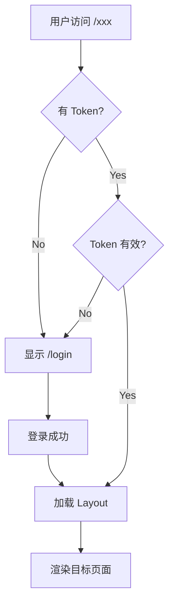
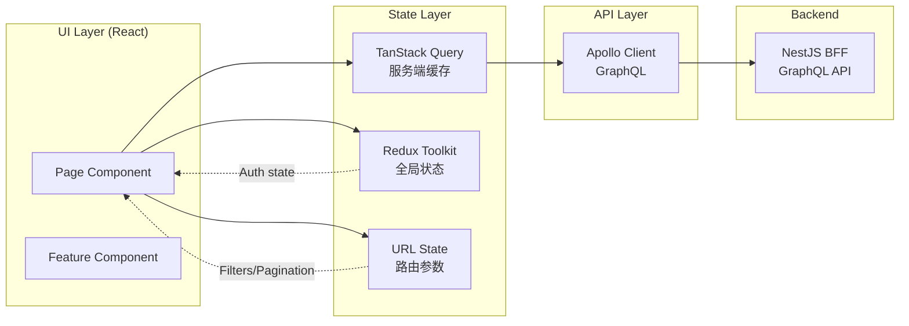
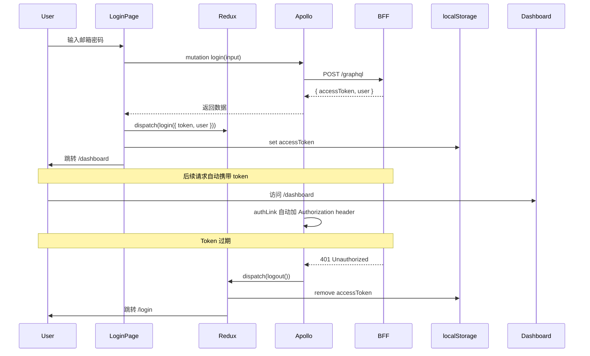

# HyperPush 前端 UI 架构规划

> 目标：为 CodePush 通用管理控制台设计完整的前端 UI 架构
> 技术栈：Vite + React 19 + TanStack Router + Redux Toolkit + TanStack Query + Apollo Client + TailwindCSS 4 + i18next
> 前置条件：Phase 1 (Foundation Fix) 已完成，Backend GraphQL 由你后续自行实现

---

## 目录

1. [页面路由结构](#一页面路由结构)
2. [组件树设计](#二组件树设计)
3. [数据流架构](#三数据流架构)
4. [状态管理方案](#四状态管理方案)
5. [认证流程](#五认证流程)
6. [页面布局与线框图](#六页面布局与线框图)
7. [UI 组件方案](#七-ui-组件方案)
8. [国际化方案](#八国际化方案)
9. [实施顺序建议](#九实施顺序建议)

---

## 一、页面路由结构

### 1.1 TanStack Router 路由定义

```
/                    → 重定向到 /dashboard
/login               → 登录页（公开）
/register            → 注册页（公开）

/dashboard           → Dashboard 概览（需认证）
/servers             → 服务器列表（需认证）
/servers/$id         → 服务器详情（需认证）
/apps                → App 列表（需认证）
/apps/$appId         → App 详情 + Deployments + Releases（需认证）
/audit-logs          → 审计日志（需认证）
/settings            → 设置（需认证）
```

### 1.2 路由守卫逻辑



### 1.3 文件结构

```
src/app/routes/
├── __root.tsx          # Root layout (Sidebar + Header + Content)
├── index.tsx           # Route tree config
├── login.tsx           # 登录页
├── register.tsx        # 注册页
├── dashboard.tsx       # Dashboard 概览
├── servers.tsx         # 服务器列表
├── servers.$id.tsx     # 服务器详情
├── apps.tsx            # App 列表
├── apps.$appId.tsx     # App 详情
├── audit-logs.tsx      # 审计日志
└── settings.tsx        # 设置

src/app/routeTree.gen.ts  # 自动生成的路由树
```

---

## 二、组件树设计

### 2.1 层级结构

```
<App>
  <RouterProvider>
    <RootLayout>                    ← __root.tsx
      <Sidebar />                   ← 左侧导航
      <div.main-content>
        <Header />                  ← 顶部栏（面包屑 + 用户菜单 + 语言切换）
        <main>
          <Outlet />                ← 页面内容
        </main>
      </div>
    </RootLayout>
  </RouterProvider>
</App>
```

### 2.2 组件目录组织

```
src/app/components/
├── ui/                           # 基础 UI 组件（shadcn/ui 风格）
│   ├── Button.tsx
│   ├── Input.tsx
│   ├── Card.tsx
│   ├── Dialog.tsx
│   ├── Table.tsx
│   ├── Badge.tsx
│   ├── Toast.tsx
│   ├── Select.tsx
│   ├── Skeleton.tsx              # Loading 骨架屏
│   ├── Spinner.tsx
│   └── EmptyState.tsx            # 空状态占位
│
├── layout/                       # 布局组件
│   ├── Sidebar.tsx
│   ├── Header.tsx
│   ├── AppLayout.tsx
│   └── NavItem.tsx               # 侧边栏导航项
│
├── auth/                         # 认证相关
│   ├── LoginForm.tsx
│   ├── RegisterForm.tsx
│   └── ProtectedRoute.tsx
│
├── servers/                      # 服务器管理
│   ├── ServerCard.tsx
│   ├── ServerForm.tsx            # 添加/编辑弹窗
│   └── ServerStatusBadge.tsx
│
├── apps/                         # App 管理
│   ├── AppCard.tsx
│   ├── AppForm.tsx
│   ├── DeploymentList.tsx
│   ├── ReleaseHistory.tsx
│   ├── ReleaseUpload.tsx         # 上传 bundle 弹窗
│   ├── PromoteDialog.tsx         # 晋升弹窗
│   ├── RollbackDialog.tsx        # 回滚弹窗
│   └── AccessKeyList.tsx
│
├── audit/                        # 审计日志
│   ├── AuditTimeline.tsx
│   └── AuditFilter.tsx
│
└── settings/                     # 设置
    ├── ProfileForm.tsx
    └── ApiKeyList.tsx
```

---

## 三、数据流架构

### 3.1 三层数据流



### 3.2 状态分离原则

| 数据类型 | 存储位置 | 示例 |
|---------|---------|------|
| **服务端数据** | TanStack Query | servers list, apps, releases, audit logs |
| **全局 UI 状态** | Redux Toolkit | auth token, user info, sidebar collapsed |
| **临时 UI 状态** | React useState | dialog open/close, form input |
| **URL 状态** | TanStack Router params | page number, search query, filter |

### 3.3 Apollo Client 配置

**文件**: [`src/app/lib/apollo-client.ts`](src/app/lib/apollo-client.ts)

```typescript
import { ApolloClient, InMemoryCache, createHttpLink } from '@apollo/client';
import { setContext } from '@apollo/client/link/context';

const httpLink = createHttpLink({ uri: '/graphql' });

const authLink = setContext((_, { headers }) => {
  const token = localStorage.getItem('accessToken');
  return {
    headers: {
      ...headers,
      Authorization: token ? `Bearer ${token}` : '',
    },
  };
});

export const apolloClient = new ApolloClient({
  link: authLink.concat(httpLink),
  cache: new InMemoryCache(),
  defaultOptions: {
    watchQuery: { fetchPolicy: 'cache-and-network' },
  },
});
```

### 3.4 GraphQL 查询示例

```typescript
// servers.gql.ts
import { gql } from '@apollo/client';

export const GET_SERVERS = gql`
  query GetServers {
    servers {
      id
      name
      baseUrl
      isOnline
      createdAt
    }
  }
`;

export const CREATE_SERVER = gql`
  mutation CreateServer($input: CreateServerInput!) {
    createServer(input: $input) {
      id
      name
      baseUrl
      isOnline
    }
  }
`;

export const DELETE_SERVER = gql`
  mutation DeleteServer($id: String!) {
    deleteServer(id: $id) {
      id
    }
  }
`;
```

### 3.5 自定义 Hook 设计

每个模块导出对应的 hook，封装 TanStack Query 调用：

```
src/app/hooks/
├── useAuth.ts         # 登录/注册/登出/me
├── useServers.ts      # 服务器 CRUD
├── useApps.ts         # App CRUD (通过 Proxy)
├── useDeployments.ts  # Deployment CRUD
├── useReleases.ts     # Release 上传/历史/晋升/回滚
├── useAuditLogs.ts    # 审计日志分页查询
└── useApiKeys.ts      # API 密钥管理
```

示例（`useServers.ts`）：

```typescript
import { useQuery, useMutation } from '@apollo/client';
import { GET_SERVERS, CREATE_SERVER, DELETE_SERVER } from '../lib/gql/servers.gql';

export function useServers() {
  const { data, loading, error } = useQuery(GET_SERVERS);
  return { servers: data?.servers ?? [], loading, error };
}

export function useCreateServer() {
  const [mutate, { loading }] = useMutation(CREATE_SERVER, {
    refetchQueries: [GET_SERVERS],
  });
  return { createServer: mutate, loading };
}
```

---

## 四、状态管理方案

### 4.1 Redux Store 结构

```typescript
// src/app/store/index.ts
export const store = configureStore({
  reducer: {
    auth: authReducer,    // 认证状态
    // 其他全局状态可后续添加
  },
});
```

### 4.2 Auth Slice

```typescript
// src/app/store/slices/authSlice.ts
interface AuthState {
  user: User | null;
  accessToken: string | null;
  isAuthenticated: boolean;
}

// actions: login, logout, setUser
// 登录时存 token 到 localStorage
// 初始化时从 localStorage 恢复 token
// 登出时清除 localStorage
```

### 4.3 为什么 Auth 用 Redux 而不是 TanStack Query？

- Token 和用户信息是 **客户端状态**，不是服务端状态
- 需要在所有组件中同步访问
- Token 过期需要立即清除并跳转登录
- TanStack Query 更适合缓存服务端数据

---

## 五、认证流程

### 5.1 完整认证流



### 5.2 路由守卫实现

```typescript
// 在 __root.tsx 或路由配置中
function RootLayout() {
  const isAuthenticated = useAppSelector(state => state.auth.isAuthenticated);
  const location = useLocation();

  if (!isAuthenticated && location.pathname !== '/login' && location.pathname !== '/register') {
    return <Navigate to="/login" />;
  }

  return (
    <div className="flex h-screen">
      {isAuthenticated && <Sidebar />}
      <main>
        {isAuthenticated && <Header />}
        <Outlet />
      </main>
    </div>
  );
}
```

---

## 六、页面布局与线框图

### 6.1 全局布局

```
┌──────────────┬──────────────────────────────────────────┐
│              │  Header                                   │
│   Sidebar    │  🏠 Dashboard    👤 admin@test.com  🌐 EN │
│              ├──────────────────────────────────────────┤
│  ┌────────┐  │                                          │
│  │ 🏠     │  │                                          │
│  │ Dash   │  │                                          │
│  ├────────┤  │          Main Content                    │
│  │ 📡     │  │                                          │
│  │ Server │  │                                          │
│  ├────────┤  │                                          │
│  │ 📦     │  │                                          │
│  │ Apps   │  │                                          │
│  ├────────┤  │                                          │
│  │ 📋     │  │                                          │
│  │ Audit  │  │                                          │
│  ├────────┤  │                                          │
│  │ ⚙️     │  │                                          │
│  │ Sett   │  │                                          │
│  └────────┘  │                                          │
│              │                                          │
└──────────────┴──────────────────────────────────────────┘
```

### 6.2 Sidebar 导航项

| 图标 | 名称 | 路径 | 说明 |
|------|------|------|------|
| 🏠 | Dashboard | `/dashboard` | 概览统计 |
| 📡 | Servers | `/servers` | 服务器管理 |
| 📦 | Apps | `/apps` | App 管理 |
| 📋 | Audit Logs | `/audit-logs` | 审计日志 |
| ⚙️ | Settings | `/settings` | 设置 |

### 6.3 各页面线框图

#### Login Page
```
┌────────────────────────────────────┐
│                                    │
│        HyperPush                   │
│   CodePush Universal Console       │
│                                    │
│   ┌────────────────────────┐       │
│   │ Email                  │       │
│   ├────────────────────────┤       │
│   │ Password               │       │
│   ├────────────────────────┤       │
│   │                        │       │
│   │    [Sign In]           │       │
│   │                        │       │
│   └────────────────────────┘       │
│                                    │
│   Don't have an account? Register  │
│                                    │
└────────────────────────────────────┘
```

#### Dashboard Page
```
┌──────────────────────────────────────────────┐
│ Dashboard                                      │
│                                                │
│ ┌──────────┐ ┌──────────┐ ┌──────────┐       │
│ │ Servers  │ │   Apps   │ │ Releases │       │
│ │    3     │ │    12    │ │    45    │       │
│ │  Online  │ │  Active  │ │   Today  │       │
│ └──────────┘ └──────────┘ └──────────┘       │
│                                                │
│ Recent Activity                                │
│ ┌──────────────────────────────────────┐      │
│ │ 🟢 Created App "MyApp"    2 min ago │      │
│ │ 📤 Released v1.2.3        15 min ago│      │
│ │ 🔄 Promoted to Prod      1 hour ago│      │
│ │ 🗑️ Deleted Deployment    2 hours ago│      │
│ └──────────────────────────────────────┘      │
└──────────────────────────────────────────────┘
```

#### Servers Page
```
┌──────────────────────────────────────────────┐
│ Servers                          [+ Add Server] │
│                                                │
│ ┌──────────────────────────────────────────┐  │
│ │ 🟢 Production     code-push.example.com  │  │
│ │   Last checked: 2 min ago    [Edit][Del] │  │
│ ├──────────────────────────────────────────┤  │
│ │ 🟢 Staging        staging-cp.example.com│  │
│ │   Last checked: 1 min ago    [Edit][Del] │  │
│ ├──────────────────────────────────────────┤  │
│ │ 🔴 Dev             localhost:3000        │  │
│ │   Last checked: 5 min ago    [Edit][Del] │  │
│ └──────────────────────────────────────────┘  │
└──────────────────────────────────────────────┘
```

#### Apps Page
```
┌──────────────────────────────────────────────┐
│ Apps                            [+ Create App]  │
│                                                │
│ ┌───────┐ ┌───────┐ ┌───────┐                │
│ │MyApp  │ │TestApp│ │ProdApp│                │
│ │iOS    │ │Android│ │iOS    │                │
│ │v1.2.3 │ │v2.0.1 │ │v1.0.0 │                │
│ │Staging│ │Production│ │Staging│              │
│ │[Open] │ │[Open] │ │[Open] │                │
│ └───────┘ └───────┘ └───────┘                │
└──────────────────────────────────────────────┘
```

#### App Detail Page
```
┌──────────────────────────────────────────────┐
│ MyApp > iOS                        [Edit][Del] │
│                                                │
│ Deployments                                    │
│ ┌──────────────────────────────────────────┐  │
│ │ Staging  Key: abc123                      │  │
│ │ Latest: v1.2.3 (label: v5)  [Upload]     │  │
│ │ ── History ──                             │  │
│ │ v5  v1.2.3  2 hours ago  [Promote][Roll] │  │
│ │ v4  v1.2.2  1 day ago    [Promote][Roll] │  │
│ │ v3  v1.2.1  3 days ago   [Promote][Roll] │  │
│ ├──────────────────────────────────────────┤  │
│ │ Production  Key: xyz789                   │  │
│ │ Latest: v1.2.2 (label: v3)  [Upload]     │  │
│ │ ── History ──                             │  │
│ │ v3  v1.2.2  1 day ago    [Promote][Roll] │  │
│ │ v2  v1.2.1  3 days ago   [Promote][Roll] │  │
│ │ v1  v1.0.0  1 week ago   [Promote][Roll] │  │
│ └──────────────────────────────────────────┘  │
│                                                │
│ Access Keys                                    │
│ ┌──────────────────────────────────────────┐  │
│ │ CI/CD Key     ****1234    [Revoke]       │  │
│ │ Dev Key       ****5678    [Revoke]       │  │
│ │                         [+ New Key]     │  │
│ └──────────────────────────────────────────┘  │
└──────────────────────────────────────────────┘
```

#### Audit Logs Page
```
┌──────────────────────────────────────────────┐
│ Audit Logs                    [Filter: All ▼]  │
│                                                │
│ ┌──────────────────────────────────────────┐  │
│ │ 📤 2026-05-24 14:30  Release Upload     │  │
│ │    MyApp / Staging / v1.2.3             │  │
│ │    User: admin@test.com                  │  │
│ ├──────────────────────────────────────────┤  │
│ │ 🆕 2026-05-24 12:15  Create App         │  │
│ │    MyApp (iOS)                           │  │
│ │    User: admin@test.com                  │  │
│ ├──────────────────────────────────────────┤  │
│ │ 🔄 2026-05-24 10:00  Promote Release    │  │
│ │    MyApp / Staging → Production / v1.2.2 │  │
│ │    User: admin@test.com                  │  │
│ └──────────────────────────────────────────┘  │
│                                                │
│                                   [← Prev] [1] [2] [3] [Next →] │
└──────────────────────────────────────────────┘
```

#### Settings Page
```
┌──────────────────────────────────────────────┐
│ Settings                                       │
│                                                │
│ Profile                                        │
│ ┌──────────────────────────────────────────┐  │
│ │ Name:  Admin                              │  │
│ │ Email: admin@test.com                     │  │
│ │                          [Save Changes]   │  │
│ └──────────────────────────────────────────┘  │
│                                                │
│ API Keys                                       │
│ ┌──────────────────────────────────────────┐  │
│ │ CI/CD Key     cp_****a1b2  Last: 2h ago │  │
│ │ Dev Key       cp_****c3d4  Last: 1d ago │  │
│ │                              [+ New Key] │  │
│ └──────────────────────────────────────────┘  │
└──────────────────────────────────────────────┘
```

---

## 七、UI 组件方案

### 7.1 设计原则

- 基于 **shadcn/ui** 的风格（简洁、可定制）
- 使用 TailwindCSS 4 的 `@theme` 定义的色系（已在 globals.css 中定义）
- 所有组件都应该支持 **loading/empty/error** 三种状态
- 使用 `clsx` + `tailwind-merge` 进行 className 合并

### 7.2 核心组件规范

#### Button
```tsx
<Button variant="primary" size="md" loading>
  Save
</Button>
// variants: primary / secondary / outline / ghost / danger
// sizes: sm / md / lg
```

#### Dialog
```tsx
<Dialog open={isOpen} onClose={() => setOpen(false)}>
  <Dialog.Title>Create App</Dialog.Title>
  <Dialog.Content>
    <form>...</form>
  </Dialog.Content>
  <Dialog.Footer>
    <Button variant="outline">Cancel</Button>
    <Button>Create</Button>
  </Dialog.Footer>
</Dialog>
```

#### Card
```tsx
<Card>
  <Card.Header>
    <Card.Title>Production Server</Card.Title>
    <Badge status="online">Online</Badge>
  </Card.Header>
  <Card.Content>
    <p>baseUrl: https://...</p>
  </Card.Content>
  <Card.Footer>
    <Button variant="ghost">Edit</Button>
  </Card.Footer>
</Card>
```

#### Empty State
```tsx
<EmptyState
  icon={<ServerIcon />}
  title="No servers yet"
  description="Add your first CodePush server to get started."
  action={<Button>Add Server</Button>}
/>
```

### 7.3 状态覆盖规范

每个数据驱动组件必须覆盖以下状态：

```tsx
function ServerList() {
  const { data, loading, error } = useServers();

  if (loading) return <Skeleton variant="card" count={3} />;
  if (error) return <ErrorState message={error.message} onRetry={refetch} />;
  if (!data?.length) return <EmptyState ... />;

  return data.map(server => <ServerCard key={server.id} server={server} />);
}
```

---

## 八、国际化方案

### 8.1 i18next 配置

```typescript
// src/app/i18n/index.ts
import i18n from 'i18next';
import { initReactI18next } from 'react-i18next';
import en from './locales/en.json';
import zh from './locales/zh.json';

i18n.use(initReactI18next).init({
  resources: { en: { translation: en }, zh: { translation: zh } },
  lng: localStorage.getItem('lang') || 'en',
  fallbackLng: 'en',
  interpolation: { escapeValue: false },
});
```

### 8.2 语言文件结构

```json
// en.json
{
  "nav": {
    "dashboard": "Dashboard",
    "servers": "Servers",
    "apps": "Apps",
    "auditLogs": "Audit Logs",
    "settings": "Settings"
  },
  "common": {
    "save": "Save",
    "cancel": "Cancel",
    "delete": "Delete",
    "create": "Create",
    "edit": "Edit",
    "loading": "Loading...",
    "noData": "No data",
    "error": "Something went wrong",
    "retry": "Retry"
  },
  "auth": {
    "login": "Sign In",
    "register": "Register",
    "email": "Email",
    "password": "Password",
    "logout": "Log Out"
  },
  "servers": {
    "title": "Servers",
    "addServer": "Add Server",
    "name": "Server Name",
    "baseUrl": "Server URL",
    "apiKey": "API Key",
    "online": "Online",
    "offline": "Offline"
  },
  "apps": {
    "title": "Apps",
    "createApp": "Create App",
    "appName": "App Name",
    "platform": "Platform",
    "deployments": "Deployments",
    "releases": "Releases"
  },
  "audit": {
    "title": "Audit Logs",
    "action": "Action",
    "user": "User",
    "time": "Time",
    "detail": "Detail"
  }
}
```

### 8.3 语言切换

在 Header 中添加语言切换下拉菜单：

```tsx
<select value={i18n.language} onChange={e => {
  i18n.changeLanguage(e.target.value);
  localStorage.setItem('lang', e.target.value);
}}>
  <option value="en">English</option>
  <option value="zh">中文</option>
</select>
```

---

## 九、实施顺序建议

### Step 1: 基础设施（无后端依赖）

```
TanStack Router 配置        → 路由能跳转
Layout 组件 (Sidebar+Header)  → 能看到框架
UI 组件库 (Button/Input/Card) → 基础组件可用
Auth Slice + Apollo Client   → 认证基础设施
```

### Step 2: 认证页面（依赖后端 Auth Resolver）

```
Login Page     → 可登录
Register Page  → 可注册
Route Guard    → 未登录自动跳转
```

### Step 3: 核心管理页面（依赖后端 Servers + Proxy Resolvers）

```
Dashboard     → 统计概览
Servers Page  → 服务器 CRUD
Apps Page     → App CRUD（需 Proxy Module）
App Detail    → Deployments + Releases + AccessKeys
```

### Step 4: 辅助页面

```
Audit Logs Page  → 操作历史查看
Settings Page    → 个人信息 + API 密钥
```

### Step 5: i18n + 收尾

```
中英文语言包
全局 Error Boundary
Loading/Empty/Error 状态覆盖
响应式适配
```

---

## 总结

前端架构的核心设计决策：

1. **路由**: TanStack Router — 类型安全，参数自动推导
2. **服务端数据**: TanStack Query + Apollo Client — 缓存、重试、refetch
3. **全局状态**: Redux Toolkit — 仅存 auth 等客户端状态
4. **组件库**: 自建 shadcn/ui 风格 — 轻量，无外部依赖
5. **状态覆盖**: 每个组件必须处理 loading/empty/error
6. **国际化**: i18next — 中英文，localStorage 持久化语言偏好

这些设计确保前端和后端可以**并行开发**：后端未就绪时，前端可以用 mock 数据或 loading 状态先行开发 UI。
