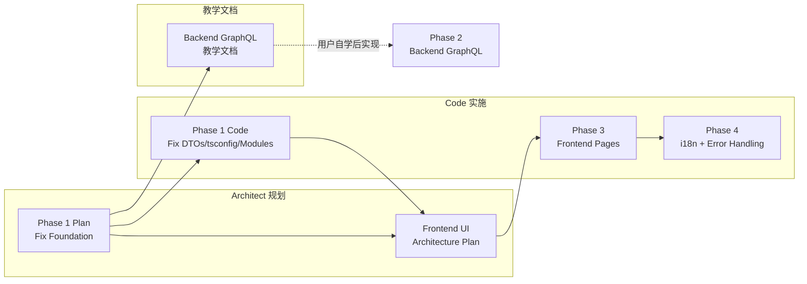

# HyperPush 实施计划（调整版）

> 调整原因：Backend GraphQL 由用户自己练手实现，我们负责修复基础 + 前端 + 教学文档

---

## 执行顺序



---

## Phase 0: 教学文档 — Backend GraphQL （用户自学用）

> 由 Architect 模式输出文档，用户对照学习后自行实现

**输出文件**: `plans/codepush-graphql-tutorial.md`

**内容覆盖**:
1. GraphQL 核心概念（Schema、Resolver、Mutation、Query）
2. `@nestjs/graphql` 框架使用（@ObjectType、@InputType、@Resolver、@Mutation、@Query）
3. Auth 模块完整实现示例（register/login/me）
4. Servers CRUD 完整实现示例
5. ApiKeys + AuditLog 实现思路
6. Proxy Module — HTTP 代理到 code-push-server
7. Module 注册 + AppModule 整合
8. 常见问题 + 调试技巧

---

## Phase 1: Fix Foundation （Code 模式实施）

> 目标：修复当前编译断裂问题，约 5 个文件

### 1.1 Fix tsconfig — 添加 DOM 类型
- [`tsconfig.json`](tsconfig.json): `lib` 添加 `"DOM"`

### 1.2 Fix Servers DTOs
- [`src/servers/dto/create-server.input.ts`](src/servers/dto/create-server.input.ts)
- [`src/servers/dto/update-server.input.ts`](src/servers/dto/update-server.input.ts)

### 1.3 Create Servers Module
- [`src/servers/servers.module.ts`](src/servers/servers.module.ts)

### 1.4 Wire AppModule
- [`src/app.module.ts`](src/app.module.ts): 导入 AuthModule + ServersModule

### 1.5 Cleanup
- 删除 `src/audit/` 目录（与 `src/audit-log/` 重复）

### 验收标准
```bash
bun run check-types   # 零 TS 错误
bun run build         # 编译通过
```

---

## Phase 2: 前端 UI 架构规划 （Architect 模式输出）

> 输出文档: `plans/hyperpush-frontend-ui-architecture.md`

**内容覆盖**:
1. 页面路由结构（TanStack Router 定义）
2. 组件树（Layout → Pages → Features → UI）
3. 数据流（Apollo Client → TanStack Query → Redux → Component）
4. 状态管理方案（全局状态 vs 服务端状态 vs URL 状态）
5. 认证流程（登录态检查、Token 刷新、路由守卫）
6. 页面线框图（登录、Dashboard、Server管理、App管理、Release、审计日志、设置）
7. 组件方案（基于 shadcn/ui 风格）
8. 中英文 i18n 方案

---

## Phase 3: Frontend Pages （Code 模式实施）

> 依赖 Phase 1 完成 + Phase 2 架构规划确定后实施

### 3.1 TanStack Router 基础
- `src/app/routes/__root.tsx`
- `src/app/routes/index.tsx`
- `src/app/main.tsx` 集成 RouterProvider

### 3.2 Auth 前端
- `src/app/store/slices/authSlice.ts`
- `src/app/lib/apollo-client.ts`
- 登录/注册页面
- Route guard (未登录跳转)

### 3.3 Layout
- Sidebar + Header + AppLayout

### 3.4 UI Component Library
- button, input, card, dialog, table, badge, toast

### 3.5 Pages（按依赖顺序）
- Dashboard → Server管理 → App管理 → Deployment/Release → 审计日志 → 设置

### 3.6 i18n
- 中英文语言包
- 语言切换

### 3.7 Error Handling
- Toast 通知
- 401 自动跳转
- Loading/Empty/Error 状态

---

## Phase 4: CI/CD + Docs （最后实施）

- GitHub Actions workflows
- Deploy scripts
- README

---

## 当前 priority

```
1️⃣ [Architect] 输出 Backend GraphQL 教学文档
2️⃣ [Code]      Phase 1 修复 DTO/tsconfig/Modules
3️⃣ [Architect] 输出前端 UI 架构规划文档
4️⃣ [Code]      Phase 3 前端页面实施
```

请问按这个顺序开始？
